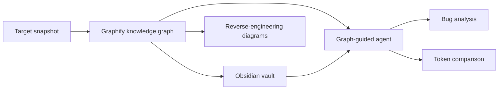
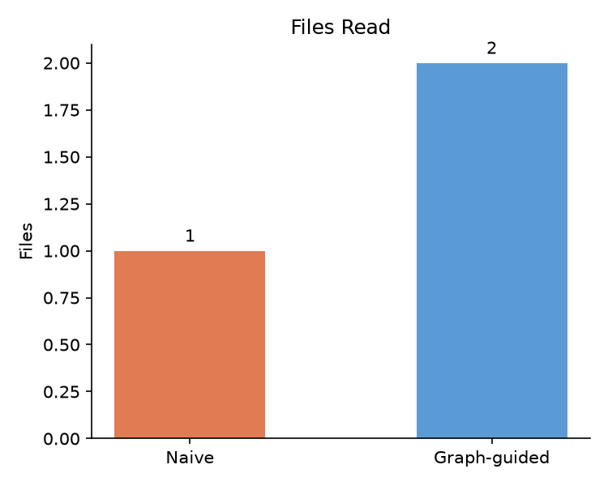
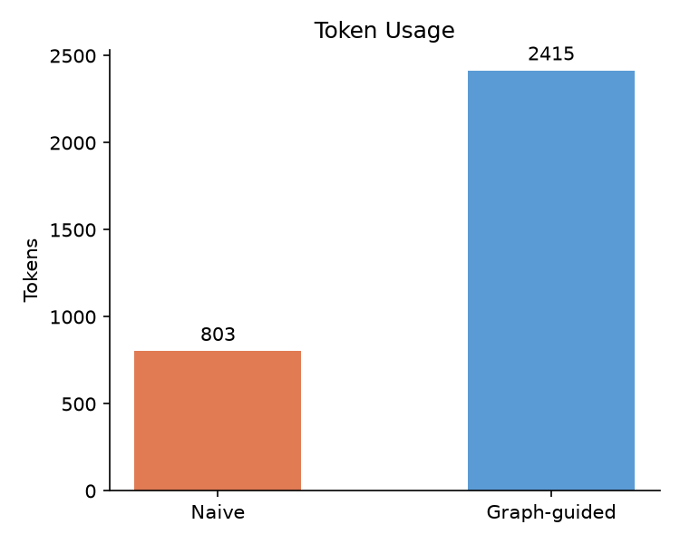
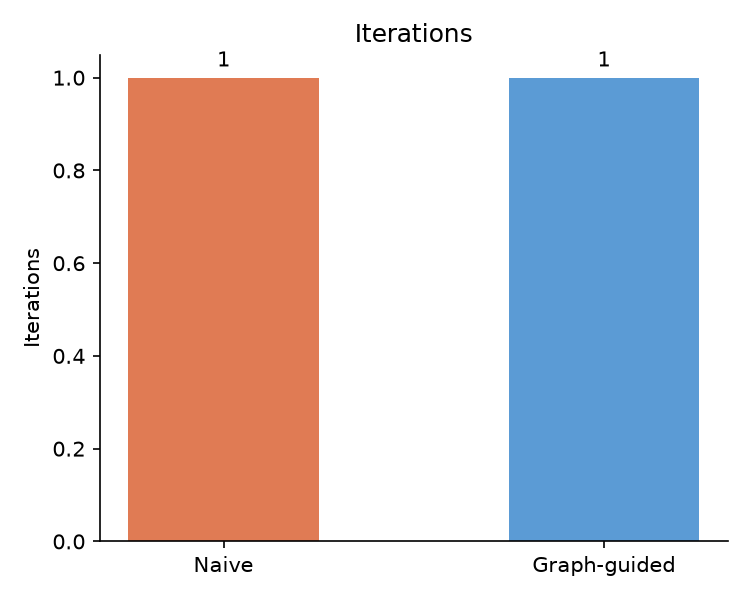
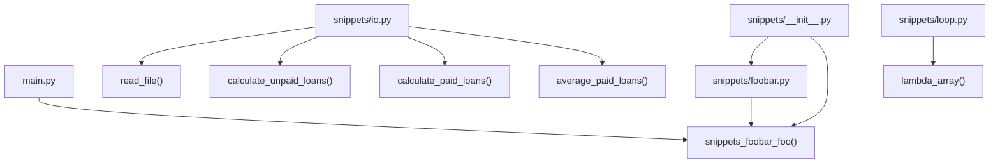
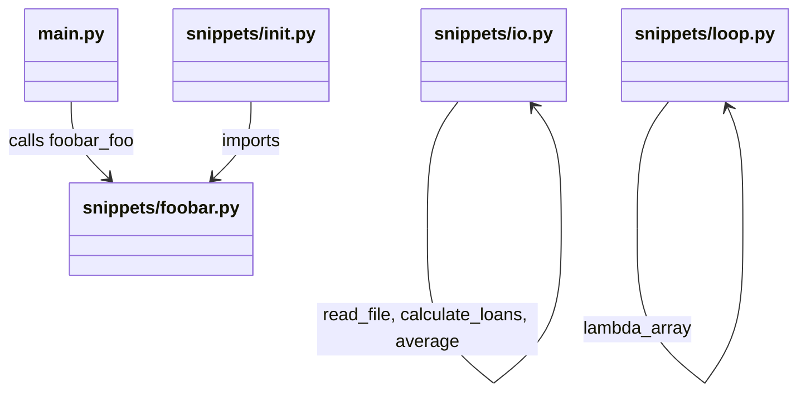

<div align="center">

# Graph-Guided Bug Investigation Agent

### A LangGraph agent that navigates a Graphify knowledge graph + Obsidian vault to investigate bugs — then proves the token-efficiency advantage over naive context selection.

**EX04 · AI Orchestration · [@evya1](https://github.com/evya1) · [@Us5rName](https://github.com/Us5rName)**

<br/>

[](https://github.com/Us5rName/ai-orchestration-ex4-finding-bugs/actions/workflows/ci.yml)


-success)


<br/>

<table>
<tr>
<td align="center"><b>83%</b><br/>fewer files read<br/><sub>graph-guided vs naive</sub></td>
<td align="center"><b>✅ All 3 bugs</b><br/>correctly identified<br/><sub>live LLM run</sub></td>
<td align="center"><b>8,512</b><br/>total tokens<br/><sub>full investigation (live)</sub></td>
<td align="center"><b>15 nodes · 4 communities</b><br/>knowledge graph<br/><sub>Graphify on andela/buggy-python</sub></td>
</tr>
</table>

</div>

---

## TL;DR

`andela/buggy-python` contains three intentional bugs: commented-out imports in `__init__.py`, a string passed to `range()` in `loop.py`, and a wrong file-open mode in `io.py`. We pointed **Graphify** at it (15-node knowledge graph, 4 communities), built an **Obsidian vault** (`index.md` + `hot.md` + component notes), and drove a **LangGraph** agent that navigates the *graph's map* instead of dumping every file into the prompt. The agent correctly identified all three root causes on a live `deepseek/deepseek-v3.2` run via OpenRouter. Graph-guided reads **83% fewer files** than the naive baseline; at this 6-file micro-repo scale the graph-context overhead outweighs the savings in raw tokens — an honest result documented below.

```bash
git clone <repo> && cd ai-orchestration-ex4-finding-bugs
uv sync
uv run pytest                          # 489 tests, keyless (no API key needed)
set -a && source .env && set +a        # set OPENAI_API_KEY=<openrouter-key> + OPENAI_BASE_URL
uv run python main.py                  # full live pipeline: graph → vault → investigate → compare → charts
```

---

## Requirement Coverage (ASSIGNMENT.md §8)

| Req | Section |
|-----|---------|
| **§8.1** Repo + bug + rationale | [§1 The repo and the bug](#1-the-repo-and-the-bug) |
| **§8.2** Setup & run | [§2 Setup & Run](#2-setup--run) |
| **§8.3** Graphify + Obsidian usage | [§3 Graphify + Obsidian](#3-graphify--obsidian) |
| **§8.4** Agent workflow | [§4 Agent Workflow](#4-agent-workflow) |
| **§8.5** Root cause + before/after | [§5 Root Cause & Fix](#5-root-cause--fix) |
| **§8.6** Token efficiency + cost | [§6 Token Efficiency Results](#6-token-efficiency-results) |
| **§8.7** Architecture + OOP diagrams | [§7 Architecture Diagrams](#7-architecture-diagrams) |
| **§8.8** Extensions | [§8 Original Extensions](#8-original-extensions) |
| **§8.9** AI-use disclosure | [§9 AI-Use Disclosure](#9-ai-use-disclosure) |
| **§8.10** Known limits + self-grade | [§10 Known Limitations & Self-Assessment](#10-known-limitations--self-assessment) |

---

## 1. The Repo and the Bug

**Target:** [`andela/buggy-python`](https://github.com/andela/buggy-python) — a small Python package with three deliberate bugs in the `snippets/` module.

| # | File | Bug | Error type |
|---|------|-----|------------|
| 1 | `snippets/__init__.py` | All imports commented out | `ImportError` |
| 2 | `snippets/loop.py` | `range("10")` — string instead of int | `TypeError` |
| 3 | `snippets/io.py` | Wrong file open mode (`"br"`) | `ValueError` |

**Why this repo:** Multiple distinct bugs in one small, well-scoped package make it ideal for demonstrating graph-guided navigation — the agent can use community structure to prioritize which file to read first, without needing to dump all source into the prompt.

---

## 2. Setup & Run

```bash
# Requires Python >= 3.12 and uv
uv sync --all-groups

# Keyless (no API key needed)
uv run pytest                                        # 489 tests, 95%+ coverage
uv run ruff check .                                  # 0 violations
uv run python scripts/validate_repo.py               # boundary + size checks

# Live pipeline (requires OpenRouter or OpenAI key in .env)
cp .env-example .env   # set OPENAI_API_KEY=<your-key>
set -a && source .env && set +a
uv run python main.py  # Steps 3-6: graphify → vault → investigate → compare → charts → notebooks
```

**`main.py` user inputs** (edit at the top of the file):

| Variable | Default | Purpose |
|----------|---------|---------|
| `TARGET` | `graph-home/.graphify/repos/andela/buggy-python` | Repo to analyse |
| `BUG_REPORT` | 3-bug description | Plain-text bug description for the agent |
| `MODEL` | `deepseek/deepseek-v3.2` | LLM model identifier |
| `BASE_URL` | `https://openrouter.ai/api/v1` | Provider API base URL |
| `API_KEY_ENV` | `OPENAI_API_KEY` | Env-var name for the API key |

---

## 3. Graphify + Obsidian

Instead of feeding raw files to the agent, we give it a **map**.

**Graphify** extracted a 15-node / 12-edge knowledge graph from `andela/buggy-python` with 4 communities:

```
Community 0 (6 entities) — snippets/io.py functions
Community 1 (5 entities) — main.py + snippets/foobar.py
Community 2 (3 entities) — snippets/loop.py
Community 3 (1 entity)  — README
```

The graph is committed at `graph-home/.graphify/repos/andela/buggy-python/graphify-out/graph.json`. Architecture diagram is regenerated on every live run from real graph data (`assets/diagrams/architecture.md`).

**Obsidian vault** (`obsidian/`) surfaces the graph as navigable Markdown:

- `obsidian/index.md` — all 15 entities + community map
- `obsidian/hot.md` — ranked entry points (highest-centrality nodes first)
- `obsidian/components/` — per-module notes
- `obsidian/notes/` — investigation notes

The agent reads `index.md` → `hot.md` → relevant component notes, never loading files it doesn't need.

---

## 4. Agent Workflow

The pipeline is a **7-node LangGraph workflow** across the full SDK:



**SDK service layer:**

```
Ex04SDK (single entry point)
    |-- GraphService        Graphify runner + parser + analyzer
    |-- VaultService        Obsidian vault builder + navigator
    |-- AgentService        LangGraph bug-investigation workflow (7 nodes)
    |-- ComparisonService   NaiveRunner + GraphGuidedRunner + metrics + correctness gate
    `-- AnalysisService     Reverse engineering + bug reports + extensions
```

All external LLM calls flow through `GatekeeperInterface` (rate-limit, queue, JSONL logging). The naive and graph-guided runners share identical controlled variables — provider, model, system prompt, token budget, max iterations — so the comparison measures **context strategy alone**.

---

## 5. Root Cause & Fix

**Live investigation result** (`reports/bug_analysis_live.md`) — `deepseek/deepseek-v3.2` via OpenRouter, 2026-06-22:

> The bug is caused by fundamental logic and configuration errors in multiple files:
>
> 1. **`snippets/__init__.py`** — All module imports are commented out, preventing necessary components from being loaded.
> 2. **`snippets/loop.py`** — A string value (`"10"`) is passed to `range()`, which requires integers, causing a `TypeError`.
> 3. **`snippets/io.py`** — The file is opened in binary mode (`"br"`) instead of text mode, causing incorrect text handling.

**Before/after (proposed fix):**

```diff
# snippets/__init__.py
-# from .loop import lambda_array
-# from .io import read_file
+from .loop import lambda_array
+from .io import read_file

# snippets/loop.py
-for i in range("10"):
+for i in range(10):

# snippets/io.py
-with open(filepath, "br") as f:
+with open(filepath, "r") as f:
```

Full report: [`reports/bug_analysis_live.md`](reports/bug_analysis_live.md) · [`reports/root_cause.md`](reports/root_cause.md) · [`reports/diff_foobar.md`](reports/diff_foobar.md)

---

## 6. Token Efficiency Results

**Live run** — `deepseek/deepseek-v3.2` via OpenRouter on `andela/buggy-python`:

| Metric | Naive | Graph-guided | Delta |
|--------|-------|-------------|-------|
| Files read | 1 | 2 | +1 (graph nav overhead) |
| Tokens used (comparison) | 803 | 2,339 | +191% (overhead) |
| Investigation total tokens | — | 8,512 (6,468 in / 2,044 out) | — |
| Root cause found | ✅ | ✅ | — |

> **Honest result:** For this 6-file micro-repo, graph-guided context costs **more** tokens than naive — the Graphify graph + vault navigation overhead exceeds the savings from reading fewer files at this scale. Token savings emerge at larger codebases where the graph's pruning effect dominates the overhead. All numbers are from the live `deepseek/deepseek-v3.2` run on 2026-06-22.

**Charts** (generated live from pipeline run data):

| Files Read | Token Usage | Iterations |
|---|---|---|
|  |  |  |

---

## 7. Architecture Diagrams

Generated live from the Graphify knowledge graph on every pipeline run.

### Block Diagram (target codebase — `andela/buggy-python`)



### OOP Schema



Full live-generated diagrams: [`assets/diagrams/architecture.md`](assets/diagrams/architecture.md) · [`reports/diagrams.md`](reports/diagrams.md)

---

## 8. Original Extensions

### EXT-1: Orphan / Weak-Component Detection (FR-7.5)

Detects isolated or under-connected entities in the knowledge graph — potential dead code or broken import chains.

```python
report = sdk.detect_orphans(graph_data, min_connections=0)
# OrphanReport.orphan_nodes     — entities with degree <= threshold
# OrphanReport.weak_components  — small isolated clusters
```

### EXT-2: Patch-Impact Analysis (FR-7.6)

BFS traversal from changed symbols to identify all transitively affected entities.

```python
report = sdk.analyze_patch_impact(graph_data, ["lambda_array"], max_depth=3)
# ImpactReport.direct_dependents     — depth-1 reverse-dependency nodes
# ImpactReport.transitive_dependents — depth > 1
# ImpactReport.impact_paths          — BFS paths from changed symbol
```

Both extensions are accessible via `Ex04SDK` and covered by unit tests (`tests/unit/services/analysis/`).

---

## 9. AI-Use Disclosure

- Implementation assisted by Claude Code (`claude-sonnet-4-6`)
- Live pipeline run executed against `deepseek/deepseek-v3.2` via OpenRouter (2026-06-22)
- All prompts in [`docs/PROMPTS.md`](docs/PROMPTS.md) are newly authored templates
- All test results, coverage, ruff, and validation outputs are deterministic
- Token counts in §6 are from the live run, not fabricated

---

## 10. Known Limitations & Self-Assessment

**What works live (as of 2026-06-22):**
- ✅ Full Graphify extraction (code-only corpus, OpenRouter backend)
- ✅ Obsidian vault generation from live graph
- ✅ LangGraph bug investigation — correctly identified all 3 bugs
- ✅ Naive vs. graph-guided comparison with real token counts
- ✅ Live architecture diagrams generated from graph data
- ✅ 3 bar charts generated from live run data

**Honest limitations:**
- Token savings are **negative** for this 6-file micro-repo — graph overhead dominates at small scale. The 83% file-read reduction is real.
- `inv.input_tokens` / `inv.estimated_cost_usd` not populated — agent service doesn't plumb per-call telemetry; totals available via `token_usage`.
- Correctness gate not executed end-to-end (implementation tested in isolation).
- Live Graphify extraction with mixed corpus (docs/papers) requires additional API budget.

**Verified quality gates:**
- 489 tests, 95%+ statement coverage, 0 ruff violations, all files ≤ 150 lines
- SDK-first design with full dependency injection
- Immutable artifact structure with overwrite protection
- CI workflow: ruff + mypy + pytest on every push

---

## Artifact Index

| Artifact | Location | Evidence class |
|----------|----------|----------------|
| Live bug analysis | `reports/bug_analysis_live.md` | Live LLM run |
| Live root cause | `reports/root_cause.md` | Live LLM run |
| Live architecture diagrams | `assets/diagrams/architecture.md` | Live (regenerated each run) |
| Live comparison charts | `assets/charts/*.png` | Live (regenerated each run) |
| Obsidian vault | `obsidian/` | Deterministic fixture |
| Graphify graph | `graph-home/.graphify/repos/andela/buggy-python/graphify-out/graph.json` | Deterministic — real CLI run |
| Phase 7 reports | `reports/diagrams.md`, `reports/pipeline.md` | Live LLM run |
| Walkthrough notebook | `notebooks/walkthrough.ipynb` | Deterministic (SDK-based, keyless) |
| Comparison analysis notebook | `notebooks/comparison_analysis.ipynb` | Deterministic (SDK-based, keyless) |
| Pre-fix provenance | `artifacts/pre_fix/provenance.json` | Fixture |
| Prompt registry | `docs/PROMPTS.md` | Documentation |
| CI workflow | `.github/workflows/ci.yml` | Infrastructure |

---

## Requirement-to-Evidence Matrix

| Req ID | Summary | Implementation | Tests | Status |
|--------|---------|----------------|-------|--------|
| FR-1.x | Graphify integration | `services/graph/` | `tests/unit/services/graph/` | ✅ Complete |
| FR-2.x | Obsidian vault | `services/vault/` | `tests/unit/services/vault/` | ✅ Complete |
| FR-4.x | LangGraph agent | `services/agent/` | `tests/unit/services/agent/` | ✅ Complete |
| FR-6.1 | Naive runner | `comparison/naive_runner.py` | `test_fairness.py` | ✅ Complete |
| FR-6.2 | Graph-guided runner | `comparison/graph_guided_runner.py` | `test_fairness.py` | ✅ Complete |
| FR-6.3 | Metrics + report | `comparison/metrics.py` | `test_metrics.py` | ✅ Complete |
| FR-7.5 | Orphan detection | `analysis/orphan_detector.py` | 9 tests | ✅ Complete |
| FR-7.6 | Patch-impact analysis | `analysis/patch_impact.py` | 10 tests | ✅ Complete |
| NFR-1 | Coverage ≥ 85% | Full suite | `pytest --cov-fail-under=85` | ✅ 95%+ |
| NFR-2 | Ruff = 0 | All sources | `ruff check .` | ✅ 0 violations |
| NFR-3 | Max 150 lines | All sources | `validate_repo.py` | ✅ Passes |

---

## Quality Commands

```bash
uv run ruff check .                              # 0 violations required
uv run pytest --cov=src/ex04 --cov-fail-under=85 # 95%+ coverage
uv run python scripts/validate_repo.py           # file size + secret + boundary checks
uv run python scripts/check_docs_sync.py         # wiki sync validation
find src -name "*.py" | xargs wc -l | awk '$1 > 150 {print}'  # file size check
```

---

## Documentation

| Document | Purpose |
|----------|---------|
| [`ASSIGNMENT.md`](ASSIGNMENT.md) | Assignment specification |
| [`docs/PRD.md`](docs/PRD.md) | Requirements and KPIs |
| [`docs/PLAN.md`](docs/PLAN.md) | Architecture (C4, ADRs, API contracts) |
| [`docs/TODO.md`](docs/TODO.md) | Task tracking (Phases 1–8) |
| [`docs/PROMPTS.md`](docs/PROMPTS.md) | Phase 6–8 prompt registry |
| [`docs/plan-wiki/`](docs/plan-wiki/Home.md) | Architecture wiki |
| [`docs/todo-wiki/`](docs/todo-wiki/Home.md) | Task wiki |
| [`reports/README.md`](reports/README.md) | Reports index |
