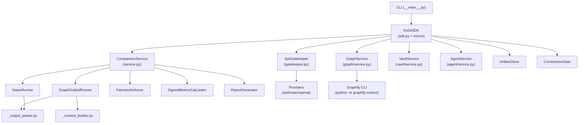

# Architecture Diagram

> [FIXTURE DEMONSTRATION — not live evidence]

```mermaid
graph TB
    CLI["CLI (__main__.py)"] --> SDK["Ex04SDK
(sdk.py + mixins)"]
    SDK --> GK["ApiGatekeeper
(gatekeeper.py)"]
    SDK --> CMP["ComparisonService
(service.py)"]
    SDK --> GRAPH["GraphService
(graph/service.py)"]
    SDK --> VAULT["VaultService
(vault/service.py)"]
    SDK --> AGENT["AgentService
(agent/service.py)"]
    CMP --> NR["NaiveRunner"]
    CMP --> GR["GraphGuidedRunner"]
    CMP --> FE["FairnessEnforcer"]
    CMP --> SM["SignedMetricsCalculator"]
    CMP --> RG["ReportGenerator"]
    GR --> CB["_context_builder.py"]
    GR --> OP["_output_parser.py"]
    NR --> OP
    GK --> PROV["Providers
(anthropic/openai)"]
    GRAPH --> GFY["Graphify CLI
(python -m graphify extract)"]
    SDK --> AS["ArtifactStore"]
    SDK --> CG["CorrectnessGate"]
```
