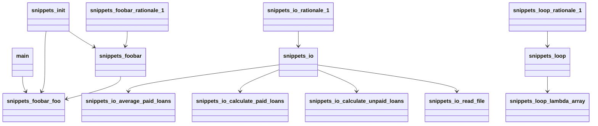

# Architecture Analysis

## Overview
- **Entities**: 15
- **Relationships**: 12
- **Communities**: 4

## Block Diagram

```mermaid
block
  id"README_md" [README.md]
  id"readme_buggy_python" [readme_buggy_python]
  id"main_py" [main.py]
  id"main" [main]
  id"snippets___init___py" [snippets/__init__.py]
  id"snippets_init" [snippets_init]
  id"snippets_foobar_py" [snippets/foobar.py]
  id"snippets_foobar" [snippets_foobar]
  id"snippets_foobar_foo" [snippets_foobar_foo]
  id"snippets_foobar_rationale_1" [snippets_foobar_rationale_1]
  id"snippets_io_py" [snippets/io.py]
  id"snippets_io" [snippets_io]
  id"snippets_io_read_file" [snippets_io_read_file]
  id"snippets_io_calculate_unpaid_loans" [snippets_io_calculate_unpaid_loans]
  id"snippets_io_calculate_paid_loans" [snippets_io_calculate_paid_loans]
  id"snippets_io_average_paid_loans" [snippets_io_average_paid_loans]
  id"snippets_io_rationale_1" [snippets_io_rationale_1]
  id"snippets_loop_py" [snippets/loop.py]
  id"snippets_loop" [snippets_loop]
  id"snippets_loop_lambda_array" [snippets_loop_lambda_array]
  id"snippets_loop_rationale_1" [snippets_loop_rationale_1]
  main --> snippets_foobar_foo
  snippets_init --> snippets_foobar
  snippets_init --> snippets_foobar_foo
  snippets_foobar --> snippets_foobar_foo
  snippets_foobar_rationale_1 --> snippets_foobar
  snippets_io --> snippets_io_average_paid_loans
  snippets_io --> snippets_io_calculate_paid_loans
  snippets_io --> snippets_io_calculate_unpaid_loans
  snippets_io --> snippets_io_read_file
  snippets_io_rationale_1 --> snippets_io
  snippets_loop --> snippets_loop_lambda_array
  snippets_loop_rationale_1 --> snippets_loop
```

## OOP Schema



## Entity Summary
- **code**: 11
- **document**: 1
- **rationale**: 3

## Relationships
- **contains**: 6
- **imports**: 2
- **rationale_for**: 3
- **re_exports**: 1

## Communities
- **Community 1**: 5 entities
- **Community 0**: 6 entities
- **Community 2**: 3 entities
- **Community 3**: 1 entities

## Patterns
- **Central Component**: snippets_foobar_foo has 3 incoming relationships

## LLM Insights

Based on the provided architectural summary, here are several insights regarding design quality, coupling, and potential improvements:

*   **High Cohesion, Low Coupling:** The system is well-organized into distinct functional modules (`snippets_foobar`, `snippets_io`, `snippets_loop`), each managing its own concerns. Relationships are primarily **contains** and **imports** within these modules, indicating healthy intra-module cohesion and limited, explicit inter-module coupling.
*   **Centralized Logic Risk:** The entity `snippets_foobar_foo` is identified as a "Central Component" with three incoming dependencies. While not excessive, this warrants review to ensure it hasn't become a *god function/class* accumulating unrelated logic, which could become a bottleneck for change.
*   **Rationale Documentation is Decoupled:** The presence of dedicated `rationale` entities linked via `rationale_for` relationships is a positive pattern for separating concerns. This keeps explanatory documentation distinct from code, aiding maintainability.
*   **Opportunity for Interface Definition:** The `snippets_io` module exposes several calculation functions (`calculate_unpaid_loans`, `average_paid_loans`, etc.). To reduce coupling and improve testability, consider defining a clear interface or abstract base class for these related operations if they are likely to have multiple implementations or need to be mocked.
*   **Community 3 as a Singleton:** "Community 3" contains a single entity, which is structurally isolated. This is often acceptable for an entry point (like `main.py`) or a standalone utility, but it should be validated that this isolation is intentional and not a sign of misplaced functionality.
