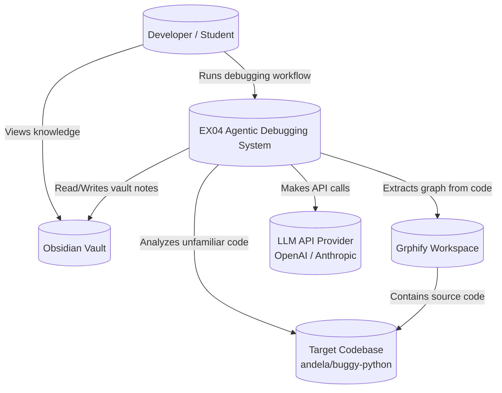
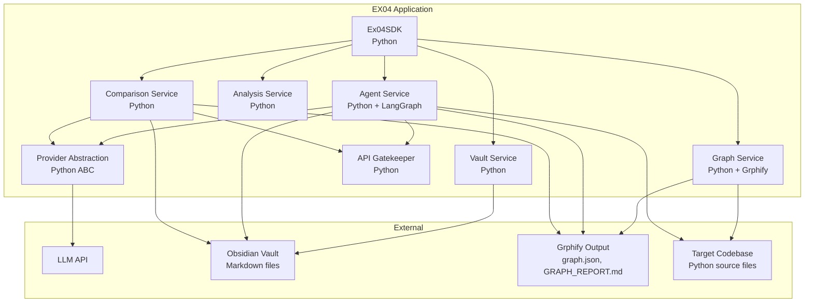
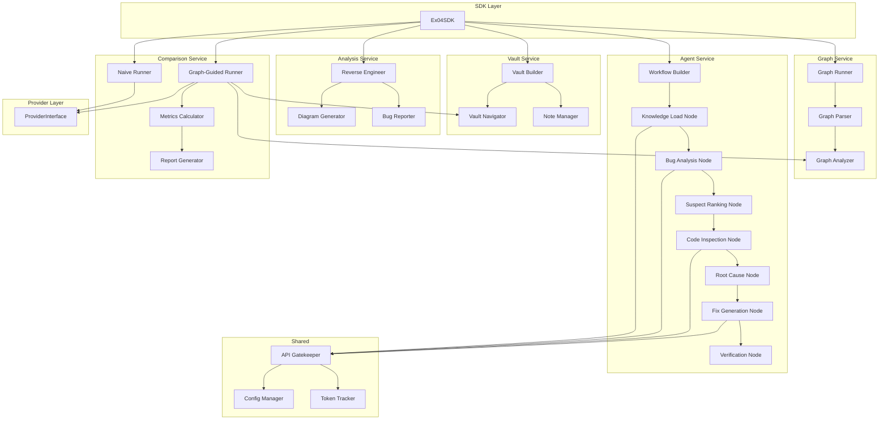
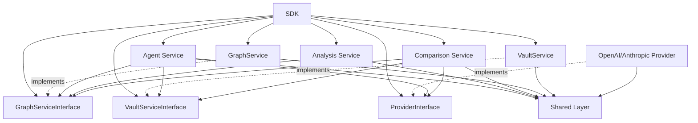
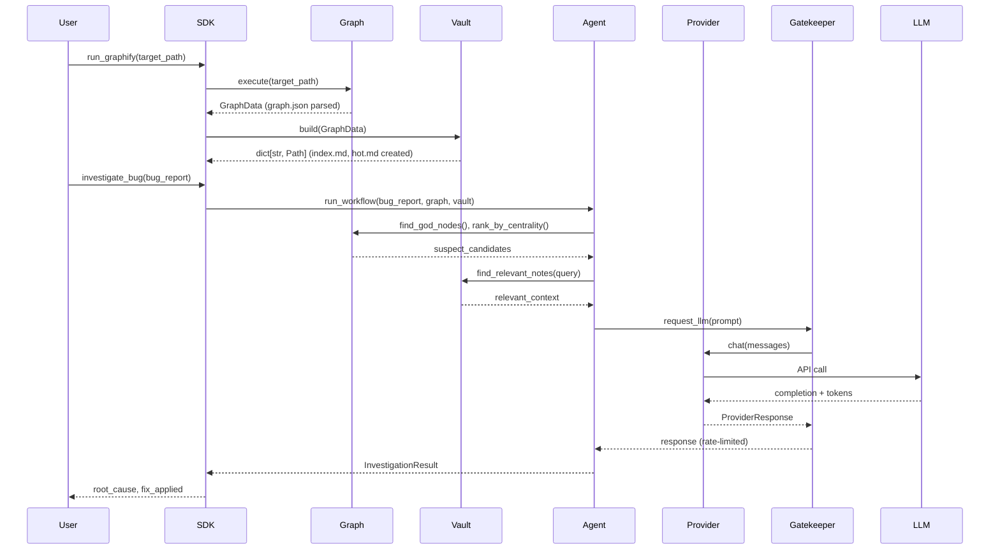
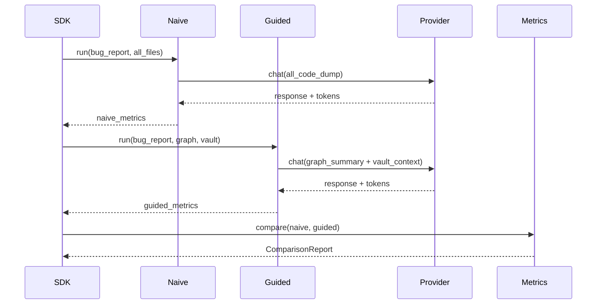
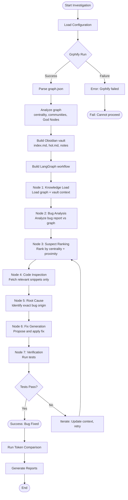

# Architecture Plan (PLAN) — EX04

| Field | Value |
|---|---|
| **Project** | EX04 — Reverse Engineering, Debugging & Token-Efficient Agentic AI |
| **Version** | 1.00 |
| **Author** | Lahav |
| **Date** | 2026-06-19 |
| **Status** | Draft |
| **PRD Reference** | `docs/PRD.md` v1.00 |

---

## Table of Contents

1. [Architecture Overview](#1-architecture-overview)
   1.1. [Design Philosophy](#11-design-philosophy)
   1.2. [High-Level Architecture](#12-high-level-architecture)
2. [C4 Model](#2-c4-model)
   2.1. [C4 Context Diagram](#21-c4-context-diagram)
   2.2. [C4 Container Diagram](#22-c4-container-diagram)
   2.3. [C4 Component Diagram](#23-c4-component-diagram)
3. [Module Design](#3-module-design)
   3.1. [Module Dependency Graph](#31-module-dependency-graph)
   3.2. [SDK Module](#32-sdk-module--single-entry-point)
   3.3. [Graph Service](#33-graph-service--grphify-integration)
   3.4. [Vault Service](#34-vault-service--obsidian-management)
   3.5. [Agent Service](#35-agent-service--langgraph-workflow)
   3.6. [Analysis Service](#36-analysis-service--reverse-engineering--bug-reporting)
   3.7. [Comparison Service](#37-comparison-service--token-savings-proof)
   3.8. [Provider Layer](#38-provider-layer--provider-agnostic-llm-abstraction)
   3.9. [Shared Layer](#39-shared-layer--infrastructure)
4. [Data Flow](#4-data-flow)
   4.1. [End-to-End Workflow](#41-end-to-end-workflow)
   4.2. [Comparison Workflow](#42-comparison-workflow)
5. [Architectural Decision Records ADRs](#5-architectural-decision-records-adrs)
6. [OOP Schema](#6-oop-schema)
7. [UML Activity Diagram](#7-uml-activity-diagram--main-investigation-flow)
8. [API Contract](#8-api-contract)
   8.1. [SDK Public API](#81-sdk-public-api)
   8.2. [Provider Interface Contract](#82-provider-interface-contract)
9. [Configuration Schema](#9-configuration-schema)
   9.1. [config/setup.json](#91-configsetupjson)
   9.2. [config/rate_limits.json](#92-configrate_limitsjson)
   9.3. [.env-example](#93-env-example)
10. [Project Structure](#10-project-structure-final)
11. [Traceability Matrix](#11-traceability-matrix)
12. [Revision History](#12-revision-history)

---

## 1. Architecture Overview

### 1.1 Design Philosophy

This system implements the requirements defined in **[PRD §2.1 Goals G1-G7]** and **[PRD §5 Functional Requirements FR-1 through FR-7]**. The architecture is designed around three core principles:

| Principle | Description | PRD Reference |
|---|---|---|
| **Provider-Agnostic** | LLM provider is abstracted behind `ProviderInterface` — no hardcoded vendor coupling | Aligns with [PRD §10.1 Constraints] flexibility needs |
| **SDK-First** | All business logic flows through a single SDK entry point; CLI/REST are thin presentation layers | [PRD §5.4 FR-4.1] workflow definition |
| **Modular Independence** | Each service is an independent building block with validated I/O contracts | Supports [PRD §2.2 KPIs] for testability and coverage |

### 1.2 High-Level Architecture

```mermaid
graph TD
    subgraph Consumers["External Consumers"]
        CLI[CLI]
        REST[REST API]
    end

    subgraph SDK["SDK Layer - Single Entry Point"]
        SDK[Ex04SDK]
    end

    subgraph Domain["Domain Services"]
        GRAPH[Graph Service]
        VAULT[Vault Service]
        AGENT[Agent Service]
        ANALYSIS[Analysis Service]
        COMPARISON[Comparison Service]
    end

    subgraph Providers["Provider Abstraction Layer"]
        PI[ProviderInterface]
        OPENAI[OpenAI Provider]
        ANTHROPIC[Anthropic Provider]
    end

    subgraph Infra["Infrastructure"]
        GATE[API Gatekeeper]
        CONFIG[Config Manager]
        FS[File System]
    end

    CLI --> SDK
    REST --> SDK

    SDK --> GRAPH
    SDK --> VAULT
    SDK --> AGENT
    SDK --> ANALYSIS
    SDK --> COMPARISON

    GRAPH --> FS
    VAULT --> FS
    AGENT --> PI
    COMPARISON --> PI

    PI --> OPENAI
    PI --> ANTHROPIC

    AGENT --> GATE
    COMPARISON --> GATE

    GATE --> CONFIG
```

---

## 2. C4 Model

### 2.1 C4 Context Diagram

Shows the system in relation to external actors and systems.



**Justification**: [PRD §4.1 In Scope] defines the system as analyzing `andela/buggy-python`, building Grphify graphs, managing Obsidian vaults, and calling LLM APIs. [PRD §1.3 Technology Choices] lists all five external systems.

### 2.2 C4 Container Diagram

Shows the high-level containers and technology stack.



**Justification**: Each container maps to a functional requirement group: [PRD §5.1 FR-1] → Graph Service, [PRD §5.2 FR-2] → Vault Service, [PRD §5.4 FR-4] → Agent Service, [PRD §5.6 FR-6] → Comparison Service.

### 2.3 C4 Component Diagram

Shows the internal components of the EX04 application.



**Justification**: Component decomposition follows [PRD §5.4 FR-4] for the LangGraph workflow with 7 nodes. The naive vs. graph-guided comparison aligns with [PRD §5.6 FR-6.1 to FR-6.3].

---

## 3. Module Design

Each module is an **independent building block** with a well-defined interface. **No module imports another module's concrete implementation** — all inter-module dependencies flow through `*Interface` abstract classes. This enables **fully parallel development**: every team member works against a stable contract while the actual implementation is built in parallel.

**Contract-First Rule**: For every service `XService`, an `XServiceInterface` ABC is defined **before** implementation begins. Other modules depend only on the interface. At runtime, the SDK injects the concrete implementation.

### 3.1 Module Dependency Graph (Runtime)

Solid arrows = **runtime** dependencies (after SDK wiring). Dashed arrows = **compile-time** interface imports only (no blocking).



**Key for parallel development**: `Agent Service`, `Analysis Service`, and `Comparison Service` import only `*Interface` ABCs (zero-cost, no blocking). They never import `GraphService`, `VaultService`, or provider implementations directly.

### 3.1.1 Service Interfaces (Contract Layer)

All interfaces are implemented as ABCs in their respective `interface.py` files. Signatures below match the actual code.

**GraphServiceInterface** (`services/graph/interface.py`, Phase 4 T4.01–T4.03):
```python
@abstractmethod
def extract(self, target_path: str) -> Path: ...
@abstractmethod
def parse(self, graph_path: Path) -> GraphData: ...
@abstractmethod
def analyze(self, graph_data: GraphData) -> dict[str, list]: ...
```

**VaultServiceInterface** (`services/vault/interface.py`, Phase 4 T4.04–T4.06):
```python
@abstractmethod
def build(self, graph_data: GraphData) -> dict[str, Path]: ...
@abstractmethod
def navigate(self, query: str) -> list[dict[str, str]]: ...
@abstractmethod
def update(self, note_type: str, content: str) -> Path: ...
```

**ProviderInterface** (`providers/interface.py`, Phase 3):
```python
@abstractmethod
def chat(
    self,
    messages: list[Message],
    model: str,
    base_url: str | None = None,
) -> ProviderResponse: ...
@abstractmethod
def count_tokens(self, text: str) -> int: ...
```

**AnalysisServiceInterface** (`services/analysis/interface.py`, Phase 4 T4.16–T4.18):
```python
@abstractmethod
def reverse_engineer(self, graph_data: GraphData) -> str: ...
@abstractmethod
def report(self, investigation: InvestigationResult) -> str: ...
```

**AgentServiceInterface** (`services/agent/interface.py`, Phase 4 T4.07–T4.15):
```python
@abstractmethod
def investigate(
    self,
    bug_report: str,
    graph_path: Path | None = None,
    vault_path: Path | None = None,
) -> InvestigationResult: ...
@abstractmethod
def get_state(self) -> dict: ...
```

**ComparisonServiceInterface** (`services/comparison/interface.py`, Phase 6 T6.01–T6.04):
```python
@abstractmethod
def run_comparison(
    self,
    bug_report: str,
    source_files: list[Path],
    graph_data: GraphData | None = None,
    vault_path: Path | None = None,
) -> ComparisonReport: ...
```

| Interface | Path | Defines | Enables Parallel Work For |
|---|---|---|---|
| `GraphServiceInterface` | `services/graph/interface.py` | `extract()`, `parse()`, `analyze()` | Agent, Analysis, Comparison |
| `VaultServiceInterface` | `services/vault/interface.py` | `build()`, `navigate()`, `update()` | Agent, Comparison |
| `ProviderInterface` | `providers/interface.py` | `chat()`, `count_tokens()` | Agent, Comparison |
| `AnalysisServiceInterface` | `services/analysis/interface.py` | `reverse_engineer()`, `report()` | SDK |
| `AgentServiceInterface` | `services/agent/interface.py` | `investigate()`, `get_state()` | SDK |
| `ComparisonServiceInterface` | `services/comparison/interface.py` | `run_comparison()` | SDK |

### 3.1.2 Parallel Development Schedule

```mermaid
gantt
    title Parallel Development Timeline
    dateFormat  HH:mm
    axisFormat %H:%M

    section Phase 1-2
    Shared Layer + Interfaces    :p1, 09:00, 2h

    section Phase 3 (Parallel)
    Graph Implementation         :p2a, 11:00, 3h
    Vault Implementation         :p2b, 11:00, 3h
    Provider Implementation      :p2c, 11:00, 2h

    section Phase 4 (Parallel)
    Agent against mocks          :p3a, 14:00, 3h
    Analysis against mocks       :p3b, 14:00, 2h
    Comparison against mocks     :p3c, 14:00, 2h

    section Phase 5
    SDK wires everything         :p4, 17:00, 1h
```



**Point**: After Phase 2 (interfaces are defined), **Phase 3 and 4 run fully in parallel**. No developer waits for another module's implementation.

### 3.2 SDK Module — Single Entry Point

| Attribute | Value |
|---|---|
| **Path** | `src/ex04/sdk/sdk.py` |
| **Responsibility** | Single entry point for all business operations |
| **PRD Mapping** | [PRD §5.4 FR-4] overall orchestration |

**Input**: Operation mode (`graphify`, `investigate`, `compare`, `reverse_engineer`), target codebase path, configuration.

**Output**: Operation results (graph data, investigation findings, comparison report, diagrams).

**Dependencies**: All service modules (delegates only, no direct LLM calls).

```python
class Ex04SDK:
    """
    Single entry point for all EX04 operations.

    All service dependencies are injected through constructor —
    never hard-imported. Enables parallel development via mock injection.

    Input:  graph (GraphServiceInterface), vault (VaultServiceInterface),
            agent (AgentServiceInterface), comparison (ComparisonServiceInterface),
            analysis (AnalysisServiceInterface), config (dict)
    Output: Operation results (GraphData, InvestigationResult, etc.)
    """

    def __init__(
        self,
        graph: GraphServiceInterface,
        vault: VaultServiceInterface,
        agent: AgentServiceInterface,
        comparison: ComparisonServiceInterface,
        analysis: AnalysisServiceInterface,
        config: dict[str, Any] | None = None,
    ):
        ...

    @classmethod
    def from_config(cls, config_path: str) -> Ex04SDK: ...
    def run_graphify(self, target_path: str) -> GraphData: ...
    def build_vault(self, graph_data: GraphData) -> dict[str, Path]: ...
    def investigate_bug(
        self,
        bug_report: str,
        graph_path: Path | None = None,
        vault_path: Path | None = None,
    ) -> InvestigationResult: ...
    def run_comparison(
        self,
        bug_report: str,
        source_files: list[Path],
        graph_data: GraphData | None = None,
        vault_path: Path | None = None,
    ) -> ComparisonReport: ...
    def reverse_engineer(self, target_path: str) -> str: ...
    def full_pipeline(self, target_path: str, bug_report: str) -> PipelineResult: ...
```

`from_config()` is the concrete wiring point: it builds the Phase 4 service facades
(`GraphService`, `VaultService`, `AgentService`, `AnalysisService`) and the
Phase 6-deferred `ComparisonService` facade from `config/setup.json`.

### 3.3 Graph Service — Grphify Integration

| Attribute | Value |
|---|---|
| **Path** | `src/ex04/services/graph/` |
| **Responsibility** | Run Grphify, parse graph output, analyze entity relationships |
| **PRD Mapping** | [PRD §5.1 FR-1.1 to FR-1.5] |

**Sub-modules**:

| File | Responsibility |
|---|---|
| `interface.py` | **Contract** — `GraphServiceInterface` ABC (defined FIRST) |
| `runner.py` | Execute Grphify CLI on target codebase |
| `parser.py` | Parse `graph.json` into structured `GraphData` objects |
| `analyzer.py` | Compute centrality, community detection, God Node identification |

**Input**: Target codebase path (`str`), Grphify configuration (`dict`).

**Output**: `GraphData` — structured graph with entities, relationships, communities.

**Dependencies**: Shared layer (config, file I/O). Other modules depend only on `interface.py`.

```python
# runner.py
class GraphRunner:
    """Run Grphify on a target codebase."""
    def execute(self, target_path: str) -> Path: ...  # returns graph.json path

# parser.py
class GraphParser:
    """Parse Grphify output into structured data."""
    def parse(self, graph_path: Path) -> GraphData: ...

# analyzer.py
class GraphAnalyzer:
    """Analyze graph for centrality, communities, God Nodes."""
    def find_god_nodes(self, graph: GraphData, min_degree: int = 2) -> list[str]: ...
    def rank_by_centrality(self, graph: GraphData, ref_node: str) -> list[tuple[str, float]]: ...
    def detect_communities(self, graph: GraphData) -> list[Community]: ...
```

### 3.4 Vault Service — Obsidian Management

| Attribute | Value |
|---|---|
| **Path** | `src/ex04/services/vault/` |
| **Responsibility** | Build, navigate, and update the Obsidian vault |
| **PRD Mapping** | [PRD §5.2 FR-2.1 to FR-2.5] |

**Sub-modules**:

| File | Responsibility |
|---|---|
| `interface.py` | **Contract** — `VaultServiceInterface` ABC (defined FIRST) |
| `builder.py` | Create vault structure with `index.md`, `hot.md`, component notes |
| `navigator.py` | Query vault for relevant context given a bug description |
| `note_manager.py` | Create, update, link individual notes |

**Input**: Graph data, investigation context, bug description.

**Output**: `dict[str, Path]` — mapping note types to file paths.

**Dependencies**: Shared layer (file I/O, config). Other modules depend only on `interface.py`.

```python
# builder.py
class VaultBuilder:
    """Build Obsidian vault from graph data."""
    def __init__(self, vault_path: Path) -> None: ...
    def build(self, graph_data: GraphData) -> dict[str, Path]: ...

# navigator.py
class VaultNavigator:
    """Navigate vault to find relevant context."""
    def __init__(self, vault_path: Path) -> None: ...
    def navigate(self, query: str) -> list[dict[str, str]]: ...

# note_manager.py
class NoteManager:
    """Manage individual vault notes."""
    def __init__(self, vault_path: Path) -> None: ...
    def create_note(self, title: str, content: str, links: list[str]) -> Path: ...
    def update_note(self, path: Path, content: str) -> None: ...
    def update(self, note_type: str, content: str) -> Path: ...
```

### 3.5 Agent Service — LangGraph Workflow

| Attribute | Value |
|---|---|
| **Path** | `src/ex04/services/agent/` |
| **Responsibility** | Build and execute the graph-guided debugging workflow |
| **PRD Mapping** | [PRD §5.4 FR-4.1 to FR-4.6] |

**Sub-modules**:

| File | Responsibility |
|---|---|
| `interface.py` | **Contract** — `AgentServiceInterface` ABC (defined FIRST) |
| `workflow.py` | Assemble the LangGraph state machine with all nodes |
| `nodes/knowledge.py` | Knowledge Load node — load graph + vault into context |
| `nodes/analysis.py` | Bug Analysis node — analyze bug reports against graph |
| `nodes/suspect.py` | Suspect Ranking node — rank candidates by centrality |
| `nodes/inspect.py` | Code Inspection node — fetch relevant code snippets |
| `nodes/rootcause.py` | Root Cause node — determine exact bug origin |
| `nodes/fix.py` | Fix Generation node — propose and apply code fix |
| `nodes/verify.py` | Verification node — run tests to confirm fix |
| `state.py` | Define the LangGraph state schema |

**Input**: Bug report (`str`), graph data (`GraphData`), vault path (`Path`).

**Output**: `InvestigationResult` — root cause, fix applied, test results, token usage.

**Dependencies**: Provider layer (LLM calls), Graph Service (graph data), Vault Service (vault context), Shared (gatekeeper).

```python
# state.py
class AgentState(TypedDict, total=False):
    bug_report: str
    graph_context: str
    vault_context: str
    suspects: list[Suspect]
    inspected_code: str
    root_cause: str
    proposed_fix: str
    fix_applied: bool
    test_results: dict[str, Any]
    token_usage: TokenMetrics
    iterations: int

# workflow.py
class WorkflowBuilder:
    """Assemble LangGraph debugging workflow with retry loop."""
    def __init__(self, max_iterations: int = 5) -> None: ...
    def build(self) -> CompiledStateGraph: ...
    def _verify_route(self, state: AgentState) -> str: ...

# nodes/knowledge.py
class KnowledgeLoadNode:
    """Load graph + vault context into agent state."""
    def __call__(self, state: AgentState) -> AgentState: ...

# nodes/analysis.py
class BugAnalysisNode:
    """Analyze bug report against graph context, produce initial suspects."""
    def __call__(self, state: AgentState) -> AgentState: ...

# nodes/suspect.py
class SuspectRankingNode:
    """Rank suspects by graph centrality and proximity to failure."""
    def __call__(self, state: AgentState) -> AgentState: ...

# nodes/inspect.py
class CodeInspectionNode:
    """Fetch code snippets for top-ranked suspects."""
    def __init__(self, target_path: Path) -> None: ...
    def __call__(self, state: AgentState) -> AgentState: ...

# nodes/rootcause.py
class RootCauseNode:
    """Determine exact bug origin from inspected code."""
    def __call__(self, state: AgentState) -> AgentState: ...

# nodes/fix.py
class FixGenerationNode:
    """Propose and apply code fix based on root cause."""
    def __call__(self, state: AgentState) -> AgentState: ...

# nodes/verify.py
class VerificationNode:
    """Run tests to confirm fix, increment iteration counter."""
    def __call__(self, state: AgentState) -> AgentState: ...
```

### 3.6 Analysis Service — Reverse Engineering & Bug Reporting

| Attribute | Value |
|---|---|
| **Path** | `src/ex04/services/analysis/` |
| **Responsibility** | Reverse engineer architecture, generate diagrams, produce bug reports |
| **PRD Mapping** | [PRD §5.3 FR-3.1 to FR-3.3], [PRD §5.5 FR-5.1 to FR-5.4] |

**Sub-modules**:

| File | Responsibility |
|---|---|
| `interface.py` | **Contract** — `AnalysisServiceInterface` ABC (defined FIRST) |
| `reverse_engineer.py` | Extract architectural and OOP schemas from code/graph |
| `diagram_gen.py` | Generate Mermaid diagrams (block diagram, OOP schema) |
| `bug_report.py` | Generate structured bug analysis reports |

**Input**: Graph data, code snippets, investigation results.

**Output**: `str` — Markdown with Mermaid block diagram, OOP schema, and architectural summary.

**Dependencies**: Graph Service (graph data), Shared (file I/O).

```python
class ReverseEngineer:
    """Extract architectural understanding from code/graph."""
    def extract_block_schema(self, graph: GraphData) -> str: ...  # Mermaid
    def extract_oop_schema(self, graph: GraphData) -> str: ...  # Mermaid
    def reverse_engineer(self, graph_data: GraphData) -> str: ...

class DiagramGenerator:
    """Generate and save diagrams."""
    def save_diagram(self, content: str, name: str, path: Path) -> Path: ...

class BugReporter:
    """Generate structured bug analysis report."""
    def generate(self, investigation: InvestigationResult) -> str: ...
```

### 3.7 Comparison Service — Token Savings Proof

| Attribute | Value |
|---|---|
| **Path** | `src/ex04/services/comparison/` |
| **Responsibility** | Run naive baseline and graph-guided approaches, compare metrics |
| **PRD Mapping** | [PRD §5.6 FR-6.1 to FR-6.3] |

**Sub-modules**:

| File | Responsibility |
|---|---|
| `interface.py` | **Contract** — `ComparisonServiceInterface` ABC (defined FIRST) |
| `naive_runner.py` | Execute naive approach (read all raw files, no focus) |
| `graph_guided_runner.py` | Execute graph-guided approach (via vault + graph) |
| `metrics.py` | Calculate token savings, file reads, iteration counts |
| `report_gen.py` | Generate comparison report with tables and charts |

**Input**: Bug report, target codebase path, graph data, vault path.

**Output**: `ComparisonReport` — side-by-side metrics, savings percentage, narrative.

**Dependencies**: Provider layer (LLM calls for both approaches), Graph Service (graph for guided mode), Vault Service (vault for guided mode), Shared (gatekeeper, token tracker).

```python
class NaiveRunner:
    """Run naive baseline: dump all code, no graph guidance."""
    def run(self, bug_report: str, source_files: list[Path]) -> RunMetrics: ...

class GraphGuidedRunner:
    """Run graph-guided: navigate via graph + vault first."""
    def run(self, bug_report: str, graph: GraphData, vault: VaultNavigator) -> RunMetrics: ...

class MetricsCalculator:
    """Compare two runs and calculate savings."""
    def compare(self, naive: RunMetrics, guided: RunMetrics) -> ComparisonMetrics: ...

class ReportGenerator:
    """Generate comparison report."""
    def generate(self, metrics: ComparisonMetrics) -> str: ...
```

### 3.8 Provider Layer — Provider-Agnostic LLM Abstraction

| Attribute | Value |
|---|---|
| **Path** | `src/ex04/providers/` |
| **Responsibility** | Abstract LLM provider behind unified interface |
| **PRD Mapping** | Supports [PRD §1.3 Technology Choices] — no vendor lock-in |

**Sub-modules**:

| File | Responsibility |
|---|---|
| `interface.py` | `ProviderInterface` abstract base class |
| `openai_provider.py` | OpenAI implementation |
| `anthropic_provider.py` | Anthropic implementation |
| `factory.py` | Create provider from configuration |

**Input**: Prompt text, system instructions, model name.

**Output**: `ProviderResponse` — generated text, token counts (input/output), model used.

**Dependencies**: Shared layer (config).

```python
# interface.py
class ProviderInterface(ABC):
    """Abstract interface for LLM providers.

    All LLM calls must flow through this interface to ensure
    provider-agnostic design. The Gatekeeper controls rate limits.
    Supports custom base_url for proxy/local endpoints.
    """

    @abstractmethod
    def chat(
        self,
        messages: list[Message],
        model: str,
        base_url: str | None = None,
    ) -> ProviderResponse: ...

    @abstractmethod
    def count_tokens(self, text: str) -> int: ...

# factory.py
class ProviderFactory:
    """Create provider instance from configuration."""
    @staticmethod
    def create(provider_name: str, config: dict) -> ProviderInterface: ...
    # config must include: name, model, api_key_env, base_url (optional)
```

### 3.9 Shared Layer — Infrastructure

| Attribute | Value |
|---|---|
| **Path** | `src/ex04/shared/` |
| **Responsibility** | Cross-cutting concerns: gatekeeper, config, version, tokens |
| **PRD Mapping** | [PRD §6 Non-Functional Requirements NFR-1 to NFR-10] |

**Sub-modules**:

| File | Responsibility |
|---|---|
| `gatekeeper.py` | Rate limiting, FIFO queue, API call monitoring (implements GatekeeperInterface) |
| `config.py` | Load and validate configuration from JSON/env (implements ConfigManagerInterface) |
| `version.py` | Global version tracking (1.00) |
| `token_tracker.py` | Track token consumption across all providers (TokenTrackerInterface, Phase 6) |
| `types.py` | Re-exports all shared types from sub-modules |
| `types_metrics.py` | TokenMetrics, RunMetrics, ComparisonMetrics, ComparisonReport |
| `types_results.py` | ProviderResponse, Suspect, InvestigationResult, PipelineResult |

```python
# gatekeeper.py
class ApiGatekeeper(GatekeeperInterface):
    """Centralized API call manager with rate limiting and FIFO queue."""
    def __init__(
        self,
        rate_limits_path: str = "",
        provider_configs: dict[str, dict[str, Any]] | None = None,
    ) -> None: ...
    def send(self, provider: str, messages: list[dict[str, str]]) -> ProviderResponse: ...
    def get_call_log(self) -> list[dict[str, Any]]: ...
    def get_queue_status(self) -> dict[str, Any]: ...

# config.py
class ConfigManager(ConfigManagerInterface):
    """JSON configuration manager with dot-notation access."""
    def __init__(self) -> None: ...
    def load(self, path: str) -> dict[str, Any]: ...
    def get(self, key_path: str) -> Any: ...
    def validate(self, config: dict[str, Any]) -> bool: ...

# token_tracker.py (Phase 6 — interface only, implementation deferred)
class TokenTrackerInterface(ABC):
    """Abstract token tracker for cross-session token usage tracking."""
    @abstractmethod
    def record(self, metrics: TokenMetrics) -> None: ...
    @abstractmethod
    def total(self, provider: str) -> int: ...
    @abstractmethod
    def by_session(self, session_id: str) -> dict[str, Any]: ...
    @abstractmethod
    def export(self) -> dict[str, Any]: ...

# types.py — re-exports from sub-modules
types_metrics.py:
@dataclass
class TokenMetrics:
    input_tokens: int = 0
    output_tokens: int = 0
    total_tokens: int = 0
    provider: str = ""
    model: str = ""

@dataclass
class RunMetrics:
    tokens_used: int = 0
    files_read: int = 0
    iterations: int = 0
    time_seconds: float = 0.0
    found_root_cause: bool = False

@dataclass
class ComparisonMetrics:
    naive: RunMetrics = field(default_factory=RunMetrics)
    guided: RunMetrics = field(default_factory=RunMetrics)
    token_savings_pct: float = 0.0
    file_read_savings_pct: float = 0.0
    iteration_savings_pct: float = 0.0

@dataclass
class ComparisonReport:
    metrics: ComparisonMetrics = field(default_factory=ComparisonMetrics)
    narrative: str = ""
    token_savings: int = 0

types_results.py:
@dataclass
class ProviderResponse:
    text: str = ""
    input_tokens: int = 0
    output_tokens: int = 0
    model: str = ""
    provider: str = ""
    timestamp: datetime = field(default_factory=datetime.now)

@dataclass
class Suspect:
    file_path: str
    line_start: int
    line_end: int
    score: float = 0.0
    reason: str = ""

@dataclass
class InvestigationResult:
    root_cause: str = ""
    suspects: list[Suspect] = field(default_factory=list)
    proposed_fix: str = ""
    fix_applied: bool = False
    test_results: dict[str, Any] = field(default_factory=dict)
    token_usage: TokenMetrics = field(default_factory=TokenMetrics)

@dataclass
class PipelineResult:
    graph_result: str = ""
    vault_result: str = ""
    investigation: InvestigationResult = field(default_factory=InvestigationResult)
    comparison: ComparisonReport = field(default_factory=ComparisonReport)
    engineering: str = ""

types.py (core graph types):
@dataclass
class Entity:
    name: str
    kind: str
    file_path: str = ""
    line_range: tuple[int, int] = field(default_factory=lambda: (0, 0))

@dataclass
class Relationship:
    source: str
    target: str
    type: str = ""

@dataclass
class Community:
    name: str
    entities: list[str] = field(default_factory=list)
    size: int = 0

@dataclass
class GraphData:
    entities: list[Entity] = field(default_factory=list)
    relationships: list[Relationship] = field(default_factory=list)
    communities: list[Community] = field(default_factory=list)
```

---

## 4. Data Flow

### 4.1 End-to-End Workflow



### 4.2 Comparison Workflow



---

## 5. Architectural Decision Records (ADRs)

### ADR-001: LangGraph Over CrewAI

| Field | Value |
|---|---|
| **Status** | Accepted |
| **PRD Reference** | [PRD §1.3 Technology Choices] |
| **Context** | HW allows LangGraph or CrewAI. Need to choose one. |
| **Decision** | Use **LangGraph** as the agent workflow framework. |
| **Rationale** | HW [§6.1] explicitly recommends LangGraph for limited accounts: "העדיפו LangGraph אם אתם עובדים עם חשבון חינמי מוגבל, כי קל יותר לשלוט במספר הקריאות והשלבים." LangGraph provides explicit state machines with deterministic control flow, enabling precise token counting per step. |
| **Consequences** | LangGraph-specific code in Agent Service. CrewAI path not implemented. |

### ADR-002: Provider-Agnostic LLM Abstraction

| Field | Value |
|---|---|
| **Status** | Accepted |
| **PRD Reference** | [PRD §1.3 Technology Choices], [PRD §10.2 Assumptions A3] |
| **Context** | The system needs to call LLM APIs. Hardcoding a specific provider (e.g., OpenAI) couples the system to one vendor and complicates switching for comparison experiments. |
| **Decision** | Abstract all LLM interactions behind `ProviderInterface` (ABC). Concrete implementations per provider. `ProviderFactory` creates instances from config. |
| **Rationale** | Enables switching providers via configuration alone. Facilitates token comparison experiments ([PRD §5.6 FR-6]) where different providers might be tested. Supports [PRD §6 NFR-4] no-hardcoding principle. |
| **Consequences** | Slight overhead of abstraction layer. All LLM calls flow through Gatekeeper → ProviderInterface → concrete provider. |

### ADR-003: Grphify as External Tool, Not Library Import

| Field | Value |
|---|---|
| **Status** | Accepted |
| **PRD Reference** | [PRD §5.1 FR-1] |
| **Context** | Grphify is available as a CLI tool (`graphify`) and as an importable Python library (`from graphify.build import build_from_json`, etc.). It can be invoked via subprocess or imported directly. |
| **Decision** | Invoke Grphify as an external CLI tool via subprocess to build the initial graph. Parse its output files (`graph.json`, `GRAPH_REPORT.md`). The library API (`graphify.query`, `graphify.analyze`) may be used for programmatic graph queries after the graph is built. |
| **Rationale** | Running the initial graph build as a subprocess keeps Grphify's complex extraction pipeline isolated — its failures don't crash the main application. The existing project structure has `graph-home` as a Grphify workspace, suggesting CLI usage. After the graph exists, `graphify query` / `graphify path` / `graphify explain` can be called for targeted investigation. |
| **Consequences** | Graph Service must handle subprocess execution and output parsing. Graph data format depends on Grphify's output schema (`graphify-out/graph.json`). The Agent Service can optionally use `graphify query` for graph-guided investigation. |

### ADR-004: Separate Comparison as Independent Module

| Field | Value |
|---|---|
| **Status** | Accepted |
| **PRD Reference** | [PRD §5.6 FR-6.1 to FR-6.3] |
| **Context** | Token comparison requires running two complete workflows: naive and graph-guided. This could be embedded in the Agent Service or separated. |
| **Decision** | Implement as a separate `Comparison Service` with its own `NaiveRunner` and `GraphGuidedRunner`. |
| **Rationale** | Keeps the comparison experiment isolated and independently testable. Each runner can be executed separately for debugging. The MetricsCalculator provides clear separation of concerns. Aligns with [PRD §4.1 In Scope item 6]. |
| **Consequences** | Both runners need access to Provider layer and may duplicate some agent logic. Mitigated by sharing node implementations where possible. |

### ADR-005: Contract-First Parallel Development

| Field | Value |
|---|---|
| **Status** | Accepted |
| **PRD Reference** | [PRD §4.1 In Scope] — multiple independent services |
| **Context** | The architecture defines 5 domain services (Graph, Vault, Agent, Analysis, Comparison) with cross-dependencies. Without interface separation, developers working on Agent must wait for Graph and Vault implementations to be complete before they can start coding. |
| **Decision** | Every service exposes an `*Interface` ABC. All cross-module imports target only the interface. The SDK performs dependency injection at runtime. Interfaces are defined in Phase 2 — before any implementation begins. |
| **Rationale** | Enables fully parallel development: Agent developer works against `MockGraphService` and `MockVaultService` while the real implementations are built simultaneously. Zero blocking between teams. Also improves testability — every module is testable with mocks from day one. |
| **Consequences** | Slight overhead of maintaining interfaces. SDK becomes the sole wiring point. All `interface.py` files must be created before implementation phases begin ([TODO §2 Phase 1 — T1.04 defines all contracts]). |

### ADR-006: Markdown-Based Vault Over Obsidian API

| Field | Value |
|---|---|
| **Status** | Accepted |
| **PRD Reference** | [PRD §5.2 FR-2] |
| **Context** | Obsidian vault is essentially a directory of Markdown files with internal links. Obsidian has a desktop app and a community API plugin, but neither is required. |
| **Decision** | Treat the vault as a plain Markdown directory. Build notes programmatically as `.md` files with `[[wikilinks]]`. |
| **Rationale** | No runtime dependency on Obsidian software. The vault is readable by Obsidian when opened, but our system only needs to create and read Markdown files. Simpler, more portable, and fully testable. |
| **Consequences** | Cannot use Obsidian's graph view API or plugin ecosystem. Navigation is done by parsing Markdown links, not querying an Obsidian API. |

---

## 6. OOP Schema

```mermaid
classDiagram
    class ProviderInterface {
        <<abstract>>
        +chat(messages, model) ProviderResponse
        +count_tokens(text) int
    }

    class OpenAIProvider {
        +chat(messages, model) ProviderResponse
        +count_tokens(text) int
        +_call_api(messages) dict
    }

    class AnthropicProvider {
        +chat(messages, model) ProviderResponse
        +count_tokens(text) int
        +_call_api(messages) dict
    }

    class ProviderFactory {
        +create(provider_name, config) ProviderInterface
    }

    class GraphRunner {
        +__init__(command) void
        +execute(target_path) Path
    }

    class GraphParser {
        +parse(graph_path) GraphData
        +_parse_entities(raw) list~Entity~
        +_parse_relationships(raw) list~Relationship~
    }

    class GraphAnalyzer {
        +find_god_nodes(graph, min_degree) list~str~
        +rank_by_centrality(graph, ref) list~tuple~
        +detect_communities(graph) list~Community~
    }

    class VaultBuilder {
        +__init__(vault_path) void
        +build(graph_data) dict~str, Path~
    }

    class VaultNavigator {
        +__init__(vault_path) void
        +navigate(query) list~dict~
    }

    class NoteManager {
        +create_note(title, content, links) Path
        +update_note(path, content) void
    }

    class WorkflowBuilder {
        +__init__(max_iterations) void
        +build() CompiledStateGraph
        +_verify_route(state) str
    }

    class Ex04SDK {
        +run_graphify(target_path) GraphData
        +build_vault(graph_data) dict~str, Path~
        +investigate_bug(bug_report, graph_path, vault_path) InvestigationResult
        +run_comparison(bug_report, source_files, graph_data, vault_path) ComparisonReport
        +reverse_engineer(target_path) str
        +full_pipeline(target_path, bug_report) PipelineResult
    }

    class APIGatekeeper {
        +send(provider, messages) ProviderResponse
        +get_queue_status() dict
        +get_call_log() list~dict~
    }

    class ConfigManager {
        +load(path) dict~str, Any~
        +get(key_path) Any
        +validate(config) bool
    }

    class TokenTracker {
        +record(metrics) void
        +total(provider) int
        +by_session(session_id) TokenMetrics
        +export() dict
    }

    class NaiveRunner {
        +run(bug_report, files) RunMetrics
        +_dump_all_code(files) str
        +_iterate(prompt) str
    }

    class GraphGuidedRunner {
        +run(bug_report, graph, vault) RunMetrics
        +_load_graph_context(graph) str
        +_load_vault_context(vault) str
        +_iterate(prompt) str
    }

    class MetricsCalculator {
        +compare(naive, guided) ComparisonMetrics
        +token_savings(naive, guided) float
        +file_savings(naive, guided) float
    }

    class ReverseEngineer {
        +reverse_engineer(graph_data) str
        +extract_block_schema(graph_data) str
        +extract_oop_schema(graph_data) str
    }

    class DiagramGenerator {
        +save_diagram(content, name, path) Path
        +validate_mermaid(content) bool
    }

    class BugReporter {
        +generate(investigation) str
        +_format_sections(data) str
    }

    ProviderInterface <|-- OpenAIProvider
    ProviderInterface <|-- AnthropicProvider
    ProviderFactory ..> ProviderInterface
    Ex04SDK --> GraphRunner
    Ex04SDK --> VaultBuilder
    Ex04SDK --> WorkflowBuilder
    Ex04SDK --> ReverseEngineer
    WorkflowBuilder --> GraphAnalyzer
    WorkflowBuilder --> VaultNavigator
    APIGatekeeper --> OpenAIProvider
    APIGatekeeper --> AnthropicProvider
    APIGatekeeper --> TokenTracker
    APIGatekeeper --> ConfigManager
    NaiveRunner --> APIGatekeeper
    GraphGuidedRunner --> APIGatekeeper
```



---

## 7. UML Activity Diagram — Main Investigation Flow



---

## 8. API Contract

### 8.1 SDK Public API

All external consumers interact exclusively through `Ex04SDK`:

```python
# src/ex04/sdk/sdk.py

class Ex04SDK:
    """
    Single entry point for all EX04 operations.

    Orchestrates graph extraction, vault building, agent investigation,
    reverse engineering, and token comparison.

    Usage:
        sdk = Ex04SDK.from_config("config/setup.json")
        result = sdk.full_pipeline("graph-home/.graphify/repos/andela/buggy-python")
    """

    @classmethod
    def from_config(cls, config_path: str) -> "Ex04SDK": ...

    def run_graphify(self, target_path: str) -> GraphData: ...
    """Run Grphify on target codebase. [PRD FR-1.1]"""

    def build_vault(self, graph_data: GraphData) -> dict[str, Path]: ...
    """Build Obsidian vault from graph data. [PRD FR-2.1-2.4]"""

    def investigate_bug(
        self,
        bug_report: str,
        graph_path: Path | None = None,
        vault_path: Path | None = None,
    ) -> InvestigationResult: ...
    """Run LangGraph debugging workflow. [PRD FR-4.1-4.6]"""

    def run_comparison(
        self,
        bug_report: str,
        source_files: list[Path],
        graph_data: GraphData | None = None,
        vault_path: Path | None = None,
    ) -> ComparisonReport: ...
    """Compare naive vs graph-guided token usage. [PRD FR-6.1-6.3]"""

    def reverse_engineer(self, target_path: str) -> str: ...
    """Extract architectural and OOP schemas. [PRD FR-3.1-3.3]"""

    def full_pipeline(self, target_path: str, bug_report: str) -> PipelineResult: ...
    """Execute complete pipeline: graphify → vault → investigate → compare → report."""
```

### 8.2 Provider Interface Contract

```python
# src/ex04/providers/interface.py

class ProviderInterface(ABC):
    """All LLM providers must implement this interface. [ADR-002]"""

    @abstractmethod
    def chat(
        self,
        messages: list[Message],
        model: str | None = None,
        base_url: str | None = None,
    ) -> ProviderResponse: ...

    @abstractmethod
    def count_tokens(self, text: str) -> int: ...

class ProviderResponse:
    """Standardized response from any LLM provider."""
    text: str
    input_tokens: int
    output_tokens: int
    model: str
    provider: str
    timestamp: datetime
```

---

## 9. Configuration Schema

All configuration is externalized per [PRD NFR-4] and [PRD §6].

### 9.1 `config/setup.json`

```json
{
    "project": {
        "name": "ex04",
        "version": "1.00"
    },
    "provider": {
        "name": "openai",
        "model": "gpt-4o-mini",
        "api_key_env": "OPENAI_API_KEY",
        "base_url": null
    },
    "graphify": {
        "graph_home": "./graph-home",
        "output_subdir": "graphify-out"  # Grphify always writes to <target>/graphify-out/
    },
    "vault": {
        "output_dir": "./obsidian"
    },
    "agent": {
        "max_iterations": 5,
        "max_suspects": 5,
        "context_window_tokens": 8000
    },
    "comparison": {
        "naive_file_limit": 20,
        "guided_context_limit": 4000
    },
    "paths": {
        "target_codebase": "./graph-home/.graphify/repos/andela/buggy-python",
        "reports_dir": "./reports",
        "artifacts_dir": "./artifacts"
    }
}
```

### 9.2 `config/rate_limits.json`

```json
{
    "openai": {
        "requests_per_minute": 60,
        "requests_per_day": 10000,
        "retry_attempts": 3,
        "retry_delay_seconds": 5
    },
    "anthropic": {
        "requests_per_minute": 50,
        "requests_per_day": 5000,
        "retry_attempts": 3,
        "retry_delay_seconds": 5
    }
}
```

### 9.3 `.env-example`

```bash
OPENAI_API_KEY=sk-...
OPENAI_BASE_URL=https://api.openai.com/v1
ANTHROPIC_API_KEY=sk-ant-...
ANTHROPIC_BASE_URL=https://api.anthropic.com
```

---

## 10. Project Structure (Final)

```
code/
├── pyproject.toml
├── uv.lock
├── README.md
├── ASSIGNMENT.md                 # Homework specification
├── .env-example                  # Secret placeholders
├── config/
│   ├── setup.json                # Application configuration
│   └── rate_limits.json          # API rate limits
├── src/
│   └── ex04/
│       ├── __init__.py
│       ├── sdk/
│       │   └── sdk.py            # Single SDK entry point (DI)
│       ├── services/
│       │   ├── graph/
│       │   │   ├── __init__.py
│       │   │   ├── interface.py  # [ADR-005] Contract for parallel dev
│       │   │   ├── service.py    # Facade implementing GraphServiceInterface
│       │   │   ├── runner.py     # [PRD FR-1.1] Grphify execution
│       │   │   ├── parser.py     # [PRD FR-1.1] Graph parsing
│       │   │   └── analyzer.py   # [PRD FR-1.4-1.5] Graph analysis
│       │   ├── vault/
│       │   │   ├── __init__.py
│       │   │   ├── interface.py  # [ADR-005] Contract for parallel dev
│       │   │   ├── service.py    # Facade implementing VaultServiceInterface
│       │   │   ├── builder.py    # [PRD FR-2.2-2.3] Vault creation
│       │   │   ├── navigator.py  # [PRD FR-2.5] Vault navigation
│       │   │   └── note_manager.py  # [PRD FR-2.4] Note management
│       │   ├── agent/
│       │   │   ├── __init__.py
│       │   │   ├── interface.py  # [ADR-005] Contract for parallel dev
│       │   │   ├── service.py    # Facade implementing AgentServiceInterface
│       │   │   ├── workflow.py   # [PRD FR-4.1] LangGraph assembly
│       │   │   ├── state.py      # [PRD FR-4.3] State schema
│       │   │   └── nodes/
│       │   │       ├── __init__.py
│       │   │       ├── knowledge.py   # [PRD FR-4.2] Knowledge load
│       │   │       ├── analysis.py    # [PRD FR-4.4] Bug analysis
│       │   │       ├── suspect.py     # [PRD FR-4.4] Suspect ranking
│       │   │       ├── inspect.py     # [PRD FR-4.2] Code inspection
│       │   │       ├── rootcause.py   # [PRD FR-4.4] Root cause
│       │   │       ├── fix.py         # [PRD FR-4.5] Fix generation
│       │   │       └── verify.py      # [PRD FR-4.6] Verification
│       │   ├── analysis/
│       │   │   ├── __init__.py
│       │   │   ├── interface.py  # [ADR-005] Contract for parallel dev
│       │   │   ├── service.py    # Facade implementing AnalysisServiceInterface
│       │   │   ├── reverse_engineer.py  # [PRD FR-3.1-3.2]
│       │   │   ├── diagram_gen.py       # [PRD FR-3.3]
│       │   │   └── bug_report.py        # [PRD FR-5.2]
│       │   └── comparison/
│       │       ├── __init__.py
│       │       ├── interface.py  # [ADR-005] Contract for parallel dev
│       │       ├── service.py    # Phase 6-deferred ComparisonService facade
│       │       ├── naive_runner.py      # [PRD FR-6.1]
│       │       ├── graph_guided_runner.py  # [PRD FR-6.2]
│       │       ├── metrics.py           # [PRD FR-6.3]
│       │       └── report_gen.py        # [PRD FR-6.3]
│       ├── providers/
│       │   ├── __init__.py
│       │   ├── interface.py    # ProviderInterface ABC
│       │   ├── openai_provider.py
│       │   ├── anthropic_provider.py
│       │   └── factory.py      # ProviderFactory
│       └── shared/
│           ├── __init__.py
│           ├── gatekeeper.py   # API Gatekeeper [PRD NFR-6]
│           ├── config.py       # Config Manager [PRD NFR-4]
│           ├── version.py      # Version 1.00 [PRD NFR]
│           ├── token_tracker.py # Token tracking
│           └── types.py        # Shared data types
├── obsidian/                     # Obsidian vault
├── graph-home/                   # Grphify workspace
│   ├── .graphify/
│   │   └── repos/
│   │       └── andela/
│   │           └── buggy-python/
│   └── graphify-out/             # Grphify output (graph.json, GRAPH_REPORT.md, etc.)
├── reports/                      # Analysis reports
├── tests/
│   ├── unit/
│   └── integration/
└── docs/
    ├── PRD.md
    ├── PLAN.md                   # This document
    └── TODO.md
```

---

## 11. Traceability Matrix

Maps every PRD requirement to its architectural location:

| PRD Requirement | Module | File |
|---|---|---|
| FR-1.1 Grphify execution | Graph Service | `services/graph/runner.py` |
| FR-1.2 index.md production | Vault Service | `services/vault/builder.py` |
| FR-1.3 hot.md production | Vault Service | `services/vault/builder.py` |
| FR-1.4 Community clustering | Graph Service | `services/graph/analyzer.py` |
| FR-1.5 Entity relationships | Graph Service | `services/graph/parser.py` |
| FR-2.1 Active knowledge space | Vault Service | `services/vault/builder.py` |
| FR-2.2 index.md navigation | Vault Service | `services/vault/builder.py` |
| FR-2.3 hot.md focused context | Vault Service | `services/vault/builder.py` |
| FR-2.4 Component notes | Vault Service | `services/vault/note_manager.py` |
| FR-2.5 Internal links | Vault Service | `services/vault/note_manager.py` |
| FR-3.1 Block diagram | Analysis Service | `services/analysis/diagram_gen.py` |
| FR-3.2 OOP schema | Analysis Service | `services/analysis/diagram_gen.py` |
| FR-3.3 Engineering understanding | Analysis Service | `services/analysis/reverse_engineer.py` |
| FR-4.1 LangGraph workflow | Agent Service | `services/agent/workflow.py` |
| FR-4.2 Graph-guided approach | Agent Service | `services/agent/nodes/knowledge.py` |
| FR-4.3 Context reduction | Agent Service | `services/agent/state.py` |
| FR-4.4 Bug investigation | Agent Service | `services/agent/nodes/analysis.py` |
| FR-4.5 Fix proposal | Agent Service | `services/agent/nodes/fix.py` |
| FR-4.6 Test verification | Agent Service | `services/agent/nodes/verify.py` |
| FR-5.1 Real code fix | Agent Service | `services/agent/nodes/fix.py` |
| FR-5.2 Before/after evidence | Analysis Service | `services/analysis/bug_report.py` |
| FR-5.3 Knowledge-level changes | Vault Service | `services/vault/note_manager.py` |
| FR-6.1 Naive baseline | Comparison Service | `services/comparison/naive_runner.py` |
| FR-6.2 Graph-guided mode | Comparison Service | `services/comparison/graph_guided_runner.py` |
| FR-6.3 Token comparison | Comparison Service | `services/comparison/metrics.py` |
| FR-7.1 Original extension | Agent Service | `services/agent/nodes/suspect.py` |
| FR-7.4 Dynamic diff [PRD §5.7] | Comparison Service | `services/comparison/diff_gen.py` |
| FR-7.5 Orphan detection [PRD §5.7] | Analysis Service | `services/analysis/orphan_detector.py` |
| FR-7.6 Impact report [PRD §5.7] | Analysis Service | `services/analysis/impact_reporter.py` |
| NFR-1 85% coverage | All | `tests/` |
| NFR-2 Zero Ruff | All | `pyproject.toml` |
| NFR-3 150-line limit | All | All files ≤ 150 lines |
| NFR-4 No hardcoding | Shared | `shared/config.py`, `config/*.json` |
| NFR-5 SDK-first | SDK | `sdk/sdk.py` |
| NFR-6 Gatekeeper | Shared | `shared/gatekeeper.py` |
| NFR-7 Docstrings | All | All modules |
| NFR-8 uv only | All | `pyproject.toml`, `uv.lock` |
| NFR-9 DRY | All | Shared utilities |
| NFR-10 Per-step logging [PRD §6] | Agent + Comparison | `shared/token_tracker.py`, `services/agent/workflow.py` |
| C8 Context-first constraint [PRD §10.1] | Agent Service | `services/agent/nodes/knowledge.py` |
| C9 BugsInPy isolation [PRD §10.1] | Graph Service | `services/graph/runner.py` (note only) |

---

## 12. Revision History

| Version | Date | Author | Change |
|---|---|---|---|
| 1.00 | 2026-06-19 | Lahav | Initial architecture plan |
| 1.01 | 2026-06-19 | Lahav | Add FR-7.4/7.5/7.6 and NFR-10/C8/C9 to traceability matrix; update NFR range to NFR-10 ([PRD §5.7], [PRD §6], [PRD §10.1]) |
| 1.02 | 2026-06-20 | Lahav | Sync fix: add full_pipeline to Ex04SDK OOP Schema class diagram (§6) to match plan-wiki/06-OOP-Schema.md |
| 1.03 | 2026-06-20 | Lahav | Fill missing signatures in §3: added all 6 service interface ABCs (§3.1.1), all 7 agent node classes (§3.5), shared layer Gatekeeper/ConfigManager/TokenTracker signatures, and complete dataclass types (§3.9) — sourced from actual implementation code (Traceability: [CLAUDE.md §3 SDK-First], [CLAUDE.md §4 Golden Rules]) |
| 1.04 | 2026-06-20 | Lahav | Align §3.2/3.3/3.4/3.6/4.1/6/8.1 with actual implementation: removed undefined types (Config, GraphResult, VaultResult, EngineeringResult, Node, Note, Pattern, QueueItem, Entry); replaced with actual types (GraphData, dict[str, Path], str, list[str], dict); fixed all SDK, VaultBuilder, VaultNavigator, GraphAnalyzer, ReverseEngineer, WorkflowBuilder, GraphRunner, APIGatekeeper, ConfigManager signatures to match code (Traceability: [PLAN §3.2 SDK Module], [PLAN §3.3 Graph Service], [PLAN §3.4 Vault Service], [PLAN §3.6 Analysis Service], [PLAN §4.1 Data Flow], [PLAN §6 OOP Schema], [PLAN §8.1 API Contract], [PRD §5.1 FR-1.1], [PRD §5.2 FR-2.1-2.4], [PRD §5.3 FR-3.1-3.2], [PRD §6 NFR-5]) |
| 1.05 | 2026-06-20 | Lahav | Add concrete service facade files to §3.2 and §10 project structure, and document `Ex04SDK.from_config()` as the runtime wiring point for Phase 4 facades with Comparison deferred to Phase 6. Traceability: [PRD NFR-5], [PLAN §3.1 Contract-First Rule], [PLAN §3.2 SDK Module]. |
