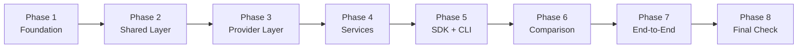

# Task Tracking (TODO) — EX04

| Field | Value |
|---|---|
| **Project** | EX04 — Reverse Engineering, Debugging & Token-Efficient Agentic AI |
| **Version** | 1.00 |
| **Author** | Lahav |
| **Date** | 2026-06-19 |
| **Status** | Draft |
| **PRD Reference** | `docs/PRD.md` v1.00 |
| **PLAN Reference** | `docs/PLAN.md` v1.00 |

---

## Table of Contents

1. [Phase Overview](#1-phase-overview)
2. [Phase 1 — Foundation](#2-phase-1--foundation)
   - [T1.01 — Create Project Directory Structure](#t101--create-project-directory-structure)
   - [T1.02 — Create Configuration Files](#t102--create-configuration-files)
   - [T1.03 — Configure pyproject.toml](#t103--configure-pyprojecttoml)
   - [T1.04 — Create Base Data Types](#t104--create-base-data-types)
3. [Phase 2 — Shared Layer](#3-phase-2--shared-layer)
   - [T2.01 — Implement Version Module](#t201--implement-version-module)
   - [T2.02 — Implement Shared Types](#t202--implement-shared-types)
   - [T2.03 — Implement Config Manager](#t203--implement-config-manager)
   - [T2.04 — Implement API Gatekeeper](#t204--implement-api-gatekeeper)
   - [T2.05 — Implement Token Tracker](#t205--implement-token-tracker)
   - [T2.06 — Shared Layer __init__.py](#t206--shared-layer-initpy)
4. [Phase 3 — Provider Layer](#4-phase-3--provider-layer)
   - [T3.01 — Implement Provider Interface](#t301--implement-provider-interface)
   - [T3.02 — Implement OpenAI Provider](#t302--implement-openai-provider)
   - [T3.03 — Implement Anthropic Provider](#t303--implement-anthropic-provider)
   - [T3.04 — Implement Provider Factory](#t304--implement-provider-factory)
   - [T3.05 — Provider Layer __init__.py](#t305--provider-layer-initpy)
5. [Phase 4 — Services](#5-phase-4--services)
   - [T4.00 — Config Manager Implementation](#t400--config-manager-implementation)
   - [T4.002 — Gatekeeper Implementation](#t4002--gatekeeper-implementation)
   - [T4.01 — Graph Service: Runner](#t401--graph-service-runner)
   - [T4.02 — Graph Service: Parser](#t402--graph-service-parser)
   - [T4.03 — Graph Service: Analyzer](#t403--graph-service-analyzer)
   - [T4.04 — Vault Service: Builder](#t404--vault-service-builder)
   - [T4.05 — Vault Service: Navigator](#t405--vault-service-navigator)
   - [T4.06 — Vault Service: Note Manager](#t406--vault-service-note-manager)
   - [T4.07 — Agent Service: State Definition](#t407--agent-service-state-definition)
   - [T4.08 — Agent Service: Workflow Builder](#t408--agent-service-workflow-builder)
   - [T4.09 — Agent Service: Knowledge Load Node](#t409--agent-service-knowledge-load-node)
   - [T4.10 — Agent Service: Bug Analysis Node](#t410--agent-service-bug-analysis-node)
   - [T4.11 — Agent Service: Suspect Ranking Node](#t411--agent-service-suspect-ranking-node)
   - [T4.12 — Agent Service: Code Inspection Node](#t412--agent-service-code-inspection-node)
   - [T4.13 — Agent Service: Root Cause Node](#t413--agent-service-root-cause-node)
   - [T4.14 — Agent Service: Fix Generation Node](#t414--agent-service-fix-generation-node)
   - [T4.15 — Agent Service: Verification Node](#t415--agent-service-verification-node)
   - [T4.16 — Analysis Service: Reverse Engineer](#t416--analysis-service-reverse-engineer)
   - [T4.17 — Analysis Service: Diagram Generator](#t417--analysis-service-diagram-generator)
   - [T4.18 — Analysis Service: Bug Reporter](#t418--analysis-service-bug-reporter)
6. [Phase 5 — SDK + CLI](#6-phase-5--sdk--cli)
   - [T5.01 — Implement SDK](#t501--implement-sdk)
   - [T5.02 — Implement CLI Entry Point](#t502--implement-cli-entry-point)
7. [Phase 6 — Comparison Service](#7-phase-6--comparison-service)
   - [T6.01 — Naive Runner](#t601--naive-runner)
   - [T6.02 — Graph-Guided Runner](#t602--graph-guided-runner)
   - [T6.03 — Metrics Calculator](#t603--metrics-calculator)
   - [T6.04 — Comparison Report Generator](#t604--comparison-report-generator)
   - [T6.05 — Implement an Additional Extension](#t605--implement-an-additional-extension)
8. [Phase 7 — End-to-End Execution](#8-phase-7--end-to-end-execution)
   - [T7.01 — Run Grphify on Target Codebase](#t701--run-grphify-on-target-codebase)
   - [T7.02 — Build Obsidian Vault](#t702--build-obsidian-vault)
   - [T7.03 — Execute Bug Investigation](#t703--execute-bug-investigation)
   - [T7.04 — Execute Token Comparison](#t704--execute-token-comparison)
   - [T7.05 — Generate Reverse Engineering Artifacts](#t705--generate-reverse-engineering-artifacts)
   - [T7.06 — Update Obsidian After Investigation](#t706--update-obsidian-after-investigation)
9. [Phase 8 — Final Check](#9-phase-8--final-check)
   - [T8.01 — Run Full Test Suite](#t801--run-full-test-suite)
   - [T8.02 — Run Ruff Lint Check](#t802--run-ruff-lint-check)
   - [T8.03 — Verify File Length Limits](#t803--verify-file-length-limits)
   - [T8.04 — Update README.md](#t804--update-readmemd)
   - [T8.05 — Final Checklist](#t805--final-checklist)
10. [Task Dependency Summary](#10-task-dependency-summary)
11. [Statistics](#11-statistics)
12. [Revision History](#12-revision-history)

---

## 1. Phase Overview

Each phase consists of **independent, verifiable tasks**. Tasks within a phase may run in parallel. Tasks between phases follow dependency order only — no task blocks another within the same phase.



| Phase | Deliverable | Independent Verification |
|---|---|---|
| **Phase 1** | Project structure, config, `.env` | `uv run ruff check` passes, structure matches [PLAN §10] |
| **Phase 2** | Shared layer fully tested | Unit tests for gatekeeper, config, version, types pass in isolation |
| **Phase 3** | Provider abstraction working | Mock-based tests verify `ProviderInterface` contract without real API |
| **Phase 4** | All services implemented | Each service testable with mocked dependencies |
| **Phase 5** | SDK orchestrates services | Integration test: SDK calls all services through mocks |
| **Phase 6** | Comparison produces metrics | Naive and guided runners produce comparable `RunMetrics` |
| **Phase 7** | Full pipeline executes | End-to-end test with real target codebase produces reports |
| **Phase 8** | Submission ready | [PRD §12 Final Checklist] passes |

---

## 2. Phase 1 — Foundation

**Goal**: Establish project structure, configuration, and tooling. No business logic yet — pure infrastructure.

### T1.01 — Create Project Directory Structure

| Attribute | Value |
|---|---|
| **Status** | Done |
| **Priority** | P0 |
| **PLAN Reference** | [PLAN §10 Project Structure] |
| **PRD Reference** | [PRD §9 Recommended Repository Structure] |
| **Estimate** | 15 min |

**Definition of Done**:

- [ ] All directories from [PLAN §10] exist
- [ ] All `__init__.py` files created in Python packages
- [ ] Empty stub files created for every module listed in [PLAN §3 Module Design]

**Independent Verification**:

```bash
find src/ex04 -type f -name "*.py" | sort
# Expected: 30+ Python files matching PLAN §10 structure
```

---

### T1.02 — Create Configuration Files

| Attribute | Value |
|---|---|
| **Status** | Partial |
| **Priority** | P0 |
| **PLAN Reference** | [PLAN §9 Configuration Schema] |
| **PRD Reference** | [PRD NFR-4] no hardcoding |
| **Estimate** | 20 min |

**Definition of Done**:

- [ ] `config/setup.json` created with schema from [PLAN §9.1]
- [ ] `config/rate_limits.json` created with schema from [PLAN §9.2]
- [ ] `.env-example` created with placeholders from [PLAN §9.3]
- [ ] `.gitignore` updated to exclude `.env`, `__pycache__`, `.venv`

**Independent Verification**:

```bash
python3 -c "import json; json.load(open('config/setup.json'))"
python3 -c "import json; json.load(open('config/rate_limits.json'))"
# Both should exit 0 (valid JSON)
```

---

### T1.03 — Configure `pyproject.toml`

| Attribute | Value |
|---|---|
| **Status** | Not Started |
| **Priority** | P0 |
| **PLAN Reference** | [PLAN §9 Configuration Schema] |
| **PRD Reference** | [PRD NFR-8] uv only, [PRD NFR-2] zero Ruff |
| **Estimate** | 20 min |

**Definition of Done**:

- [ ] `pyproject.toml` has Ruff linter configuration
- [ ] `pyproject.toml` has pytest configuration with coverage ≥ 85%
- [ ] Dependencies listed: `langgraph`, `graphify`, `openai`, `anthropic`, `pydantic`
- [ ] `uv sync` succeeds and creates virtual environment

**Independent Verification**:

```bash
uv sync
uv run ruff check --select E,F,W,I --no-fix .
uv run pytest --version
```

---

### T1.04 — Create Base Data Types

| Attribute | Value |
|---|---|
| **Status** | Not Started |
| **Priority** | P0 |
| **PLAN Reference** | [PLAN §3.9 Shared Layer — types.py] |
| **PRD Reference** | [PRD NFR-7] docstrings |
| **Estimate** | 30 min |

**Definition of Done**:

- [ ] `src/ex04/shared/types.py` contains all data classes from [PLAN §3.9]:
  - `TokenMetrics`
  - `GraphData`, `Entity`, `Relationship`, `Community`
  - `RunMetrics`
  - `ComparisonMetrics`
  - `ProviderResponse`
  - `Suspect`
  - `InvestigationResult`
  - `ComparisonReport`
- [ ] Every class has full docstring with I/O contract
- [ ] All types use `dataclass` or `TypedDict`

**Independent Verification**:

```bash
uv run python -c "from ex04.shared.types import TokenMetrics, GraphData, RunMetrics; print('OK')"
# Should import without errors
```

---

### T1.05 — Define All Service Interfaces (Contract Layer)

| Attribute | Value |
|---|---|
| **Status** | Not Started |
| **Priority** | P0 |
| **PLAN Reference** | [PLAN §3.1.1 Service Interfaces], [ADR-005] |
| **PRD Reference** | [PRD §5 Functional Requirements — contracts] |
| **Estimate** | 60 min |

**Why this task exists**: This is the **gate for parallel development**. Once these interfaces are defined, every other module can work against them independently — no one blocks anyone ([PLAN §3.1.2 Parallel Development Schedule]).

**Definition of Done**:

- [ ] `services/graph/interface.py` — `GraphServiceInterface` ABC with methods from [PLAN §3.3]
- [ ] `services/vault/interface.py` — `VaultServiceInterface` ABC with methods from [PLAN §3.4]
- [ ] `services/agent/interface.py` — `AgentServiceInterface` ABC with methods from [PLAN §3.5]
- [ ] `services/analysis/interface.py` — `AnalysisServiceInterface` ABC with methods from [PLAN §3.6]
- [ ] `services/comparison/interface.py` — `ComparisonServiceInterface` ABC with methods from [PLAN §3.7]
- [ ] Each interface only imports from `shared/types.py` (zero cross-service imports)
- [ ] Each method has docstring with I/O contract

**Independent Verification**:

```bash
uv run python -c "
from ex04.services.graph.interface import GraphServiceInterface
from ex04.services.vault.interface import VaultServiceInterface
from ex04.services.agent.interface import AgentServiceInterface
from ex04.services.analysis.interface import AnalysisServiceInterface
from ex04.services.comparison.interface import ComparisonServiceInterface
print('All interfaces importable — parallel work can begin')
"
```

---

### T1.06 — Create Mock Implementations for All Services

| Attribute | Value |
|---|---|
| **Status** | Not Started |
| **Priority** | P0 |
| **PLAN Reference** | [ADR-005 Contract-First Parallel Development] |
| **Estimate** | 60 min |

**Why this task exists**: Mock implementations let developers test their modules **before** real implementations exist. Agent developer can work against `MockGraphService` while Graph is still being built ([PLAN §3.1.2]).

**Definition of Done**:

- [ ] `tests/mocks/mock_graph_service.py` — implements `GraphServiceInterface` with synthetic data
- [ ] `tests/mocks/mock_vault_service.py` — implements `VaultServiceInterface` with synthetic data
- [ ] `tests/mocks/mock_agent_service.py` — implements `AgentServiceInterface` with canned responses
- [ ] `tests/mocks/mock_analysis_service.py` — implements `AnalysisServiceInterface` with canned outputs
- [ ] `tests/mocks/mock_comparison_service.py` — implements `ComparisonServiceInterface` with canned metrics
- [ ] `tests/mocks/mock_provider.py` — implements `ProviderInterface` with canned responses
- [ ] `tests/mocks/__init__.py` — exports all mocks
- [ ] Every mock passes basic sanity check (returns non-None, correct types)

**Independent Verification**:

```bash
uv run pytest tests/unit/test_mocks.py -v
# Verifies every mock implements its interface correctly
```

---

## 3. Phase 2 — Shared Layer

**Goal**: Implement all cross-cutting infrastructure. Fully testable without any other module.

### T2.01 — Implement Version Module

| Attribute | Value |
|---|---|
| **Status** | Not Started |
| **Priority** | P0 |
| **PLAN Reference** | [PLAN §3.9 Shared Layer — version.py] |
| **PRD Reference** | [PRD NFR] version 1.00 |
| **Estimate** | 10 min |

**Definition of Done**:

- [ ] `src/ex04/shared/version.py` exports `__version__ = "1.00"`
- [ ] Module-level docstring
- [ ] Test verifies version string format

**Independent Verification**:

```bash
uv run pytest tests/unit/shared/test_version.py -v
# Expected: 1 test passes
```

---

### T2.02 — Implement Shared Types

| Attribute | Value |
|---|---|
| **Status** | Not Started |
| **Priority** | P0 |
| **PLAN Reference** | [PLAN §3.9 Shared Layer — types.py] |
| **PRD Reference** | [PRD NFR-4] no hardcoding, [PRD §5.6 FR-6] token metrics |
| **Estimate** | 30 min |

**Definition of Done**:

- [ ] `src/ex04/shared/types.py` defines all shared data classes and TypedDicts:
  - `TokenMetrics` with `input_tokens`, `output_tokens`, `total_tokens`, `provider`, `model`
  - `GraphData` with `entities`, `relationships`, `communities`
  - `RunMetrics` with `tokens_used`, `files_read`, `iterations`, `time_seconds`, `found_root_cause`
  - `ComparisonMetrics` with `naive`, `guided`, `token_savings_pct`, `file_read_savings_pct`, `iteration_savings_pct`
  - `PipelineResult` with `graph_result`, `vault_result`, `investigation`, `comparison`, `engineering`
  - `ProviderResponse` with `text`, `input_tokens`, `output_tokens`, `model`, `provider`, `timestamp`
- [ ] All types use `dataclass` or `TypedDict` with type hints
- [ ] Module-level docstring
- [ ] Tests verify type construction and field presence
- [ ] File ≤ 150 lines ([PRD NFR-3])

**Independent Verification**:

```bash
uv run pytest tests/unit/shared/test_types.py -v --cov=ex04.shared.types --cov-report=term-missing
# Expected: ≥ 85% coverage, all tests pass
```

---

### T2.03 — Implement Config Manager

| Attribute | Value |
|---|---|
| **Status** | Not Started |
| **Priority** | P0 |
| **PLAN Reference** | [PLAN §3.9 Shared Layer — config.py] |
| **PRD Reference** | [PRD NFR-4] no hardcoding |
| **Estimate** | 45 min |

**Definition of Done**:

- [ ] `ConfigManager.load(path)` reads JSON and returns validated `Config` object
- [ ] `ConfigManager.get(key_path)` supports dot-notation access (`provider.name`)
- [ ] `ConfigManager.validate(config)` checks required fields
- [ ] Handles missing file, invalid JSON, missing required fields with clear errors
- [ ] All methods have docstrings with I/O contract
- [ ] File ≤ 150 lines ([PRD NFR-3])

**Independent Verification**:

```bash
uv run pytest tests/unit/shared/test_config.py -v --cov=ex04.shared.config --cov-report=term-missing
# Expected: ≥ 85% coverage, all tests pass
```

---

### T2.04 — Implement API Gatekeeper

| Attribute | Value |
|---|---|
| **Status** | Not Started |
| **Priority** | P0 |
| **PLAN Reference** | [PLAN §3.9 Shared Layer — gatekeeper.py] |
| **PRD Reference** | [PRD NFR-6] all API calls through gatekeeper |
| **Estimate** | 90 min |

**Definition of Done**:

- [ ] `APIGatekeeper.send(provider, messages)` executes call through provider and returns `ProviderResponse`
- [ ] Rate limiting enforced from `config/rate_limits.json`
- [ ] FIFO queue for overflow requests — never crash on rate limit
- [ ] Call log with timestamps available via `get_call_log()`
- [ ] Queue status available via `get_queue_status()`
- [ ] Retry logic with configurable attempts and delay
- [ ] All methods have docstrings with I/O contract
- [ ] File ≤ 150 lines — split queue logic to `queue.py` if needed

**Independent Verification**:

```bash
uv run pytest tests/unit/shared/test_gatekeeper.py -v --cov=ex04.shared.gatekeeper --cov-report=term-missing
# Expected: ≥ 85% coverage
# Tests use MockProvider — no real API calls
```

---

### T2.05 — Implement Token Tracker

| Attribute | Value |
|---|---|
| **Status** | Not Started |
| **Priority** | P1 |
| **PLAN Reference** | [PLAN §3.9 Shared Layer — token_tracker.py] |
| **PRD Reference** | [PRD §5.6 FR-6] token comparison metrics |
| **Estimate** | 45 min |

**Definition of Done**:

- [ ] `TokenTracker.record(metrics)` stores token usage per session
- [ ] `TokenTracker.total(provider)` returns cumulative tokens by provider
- [ ] `TokenTracker.by_session(session_id)` returns session-level metrics
- [ ] `TokenTracker.export()` returns serializable dict
- [ ] Thread-safe implementation (for parallel comparison runs)
- [ ] All methods have docstrings with I/O contract

**Independent Verification**:

```bash
uv run pytest tests/unit/shared/test_token_tracker.py -v --cov=ex04.shared.token_tracker --cov-report=term-missing
# Expected: ≥ 85% coverage
```

---

### T2.06 — Shared Layer `__init__.py`

| Attribute | Value |
|---|---|
| **Status** | Not Started |
| **Priority** | P0 |
| **PLAN Reference** | [PLAN §3.9 Shared Layer] |
| **Estimate** | 5 min |

**Definition of Done**:

- [ ] `src/ex04/shared/__init__.py` exports all public types and classes
- [ ] Import verification passes

**Independent Verification**:

```bash
uv run python -c "from ex04.shared import APIGatekeeper, ConfigManager, TokenTracker, TokenMetrics, GraphData; print('OK')"
```

---

## 4. Phase 3 — Provider Layer

**Goal**: Provider-agnostic LLM abstraction. Fully testable with mocks — no real API calls needed for unit tests.

### T3.01 — Implement Provider Interface

| Attribute | Value |
|---|---|
| **Status** | Not Started |
| **Priority** | P0 |
| **PLAN Reference** | [PLAN §3.8 Provider Layer — interface.py], [ADR-002] |
| **PRD Reference** | [PRD §1.3] no vendor lock-in |
| **Estimate** | 20 min |

**Definition of Done**:

- [ ] `ProviderInterface` ABC with `chat()` and `count_tokens()` abstract methods
- [ ] `ProviderResponse` dataclass with fields: `text`, `input_tokens`, `output_tokens`, `model`, `provider`, `timestamp`
- [ ] `Message` TypedDict with `role` and `content`
- [ ] Full docstrings on all symbols

**Independent Verification**:

```bash
uv run python -c "from ex04.providers.interface import ProviderInterface, ProviderResponse, Message; print('OK')"
```

---

### T3.02 — Implement OpenAI Provider

| Attribute | Value |
|---|---|
| **Status** | Not Started |
| **Priority** | P0 |
| **PLAN Reference** | [PLAN §3.8 Provider Layer — openai_provider.py] |
| **Estimate** | 60 min |

**Definition of Done**:

- [ ] `OpenAIProvider` implements `ProviderInterface`
- [ ] `chat()` maps to OpenAI API, returns `ProviderResponse` with token counts
- [ ] `count_tokens()` uses tiktoken library
- [ ] API key loaded from environment variable (configurable)
- [ ] Error handling: retries on rate limit, timeout, API errors
- [ ] File ≤ 150 lines

**Independent Verification**:

```bash
uv run pytest tests/unit/providers/test_openai_provider.py -v --cov=ex04.providers.openai_provider --cov-report=term-missing
# Uses mocked OpenAI client — no real API calls
```

---

### T3.03 — Implement Anthropic Provider

| Attribute | Value |
|---|---|
| **Status** | Not Started |
| **Priority** | P1 |
| **PLAN Reference** | [PLAN §3.8 Provider Layer — anthropic_provider.py] |
| **Estimate** | 60 min |

**Definition of Done**:

- [ ] `AnthropicProvider` implements `ProviderInterface`
- [ ] `chat()` maps to Anthropic API, returns `ProviderResponse` with token counts
- [ ] `count_tokens()` uses Anthropic tokenizer
- [ ] API key loaded from environment variable (configurable)
- [ ] Error handling: retries on rate limit, timeout, API errors
- [ ] File ≤ 150 lines

**Independent Verification**:

```bash
uv run pytest tests/unit/providers/test_anthropic_provider.py -v --cov=ex04.providers.anthropic_provider --cov-report=term-missing
# Uses mocked Anthropic client — no real API calls
```

---

### T3.04 — Implement Provider Factory

| Attribute | Value |
|---|---|
| **Status** | Not Started |
| **Priority** | P0 |
| **PLAN Reference** | [PLAN §3.8 Provider Layer — factory.py] |
| **Estimate** | 30 min |

**Definition of Done**:

- [ ] `ProviderFactory.create(name, config)` returns appropriate `ProviderInterface`
- [ ] Supports `openai` and `anthropic` provider names
- [ ] Raises `ValueError` for unknown provider
- [ ] Raises `RuntimeError` if required API key missing
- [ ] File ≤ 150 lines

**Independent Verification**:

```bash
uv run pytest tests/unit/providers/test_factory.py -v --cov=ex04.providers.factory --cov-report=term-missing
# Tests factory routing without real API calls
```

---

### T3.05 — Provider Layer `__init__.py`

| Attribute | Value |
|---|---|
| **Status** | Not Started |
| **Priority** | P0 |
| **PLAN Reference** | [PLAN §3.8 Provider Layer] |
| **Estimate** | 5 min |

**Independent Verification**:

```bash
uv run python -c "from ex04.providers import ProviderInterface, ProviderFactory; print('OK')"
```

---

## 5. Phase 4 — Services

**Goal**: Implement all domain services and shared layer contracts deferred from Phase 2. Each service imports only `*Interface` contracts — never concrete implementations from other services. Real wiring happens through SDK at runtime ([ADR-005]).

> **Rationale for T4.00–T4.002**: `ConfigManagerInterface` and `GatekeeperInterface` were defined as contracts in Phase 2 ([PLAN §3.9]) with "impl in P4" comments. All domain services depend on these. Implemented here as prerequisites before any service work.

### T4.00 — Config Manager Implementation

| Attribute | Value |
|---|---|
| **Status** | Not Started |
| **Priority** | P0 |
| **PLAN Reference** | [PLAN §3.9 Shared Layer — config.py] |
| **PRD Reference** | [PRD NFR-4] configuration externalization |
| **Estimate** | 30 min |

**Definition of Done**:

- [ ] `ConfigManager` implements `ConfigManagerInterface`
- [ ] `load(path)` reads JSON config file and caches
- [ ] `get(key_path)` supports dot-notation (e.g. `agent.max_iterations`)
- [ ] `validate(config)` checks required fields
- [ ] No hardcoded config values — all from `config/setup.json`
- [ ] File ≤ 150 lines

**Independent Verification**:

```bash
uv run pytest tests/unit/shared/test_config_impl.py -v --cov=ex04.shared.config --cov-report=term-missing
```

---

### T4.002 — Gatekeeper Implementation

| Attribute | Value |
|---|---|
| **Status** | Not Started |
| **Priority** | P0 |
| **PLAN Reference** | [PLAN §3.9 Shared Layer — gatekeeper.py] |
| **PRD Reference** | [PRD NFR-1] API call management |
| **Estimate** | 60 min |

**Definition of Done**:

- [ ] `ApiGatekeeper` implements `GatekeeperInterface`
- [ ] `send(provider, messages)` routes through `ProviderFactory`, enforces rate limits
- [ ] Rate limits loaded from `config/rate_limits.json`
- [ ] FIFO queue for overflow requests
- [ ] Retry logic with configurable attempts/delay
- [ ] `get_call_log()` returns timestamped call records
- [ ] `get_queue_status()` returns queue depth and state
- [ ] All LLM calls in agent nodes flow through gatekeeper
- [ ] File ≤ 150 lines

**Independent Verification**:

```bash
uv run pytest tests/unit/shared/test_gatekeeper_impl.py -v --cov=ex04.shared.gatekeeper --cov-report=term-missing
# Tests with mocked provider — no real API calls
```

---

### T4.01 — Graph Service: Runner

| Attribute | Value |
|---|---|
| **Status** | Not Started |
| **Priority** | P0 |
| **PLAN Reference** | [PLAN §3.3 Graph Service — runner.py] |
| **PRD Reference** | [PRD FR-1.1] |
| **Estimate** | 60 min |

**Definition of Done**:

- [ ] `GraphRunner.execute(target_path)` invokes Grphify CLI via subprocess
- [ ] Returns path to generated `graph.json`
- [ ] Handles subprocess failures, missing Grphify, invalid target
- [ ] Logs execution output for debugging
- [ ] File ≤ 150 lines

**Independent Verification**:

```bash
uv run pytest tests/unit/services/graph/test_runner.py -v --cov=ex04.services.graph.runner --cov-report=term-missing
# Tests with mocked subprocess — no real Grphify invocation
```

---

### T4.02 — Graph Service: Parser

| Attribute | Value |
|---|---|
| **Status** | Not Started |
| **Priority** | P0 |
| **PLAN Reference** | [PLAN §3.3 Graph Service — parser.py] |
| **PRD Reference** | [PRD FR-1.1] graph.json parsing |
| **Estimate** | 60 min |

**Definition of Done**:

- [ ] `GraphParser.parse(graph_path)` reads `graph.json` and returns `GraphData`
- [ ] Extracts entities, relationships, communities from Grphify output
- [ ] Handles missing fields, malformed JSON, empty graph
- [ ] File ≤ 150 lines

**Independent Verification**:

```bash
uv run pytest tests/unit/services/graph/test_parser.py -v --cov=ex04.services.graph.parser --cov-report=term-missing
# Tests with sample graph.json fixtures
```

---

### T4.03 — Graph Service: Analyzer

| Attribute | Value |
|---|---|
| **Status** | Not Started |
| **Priority** | P0 |
| **PLAN Reference** | [PLAN §3.3 Graph Service — analyzer.py] |
| **PRD Reference** | [PRD FR-1.4-1.5], [PRD FR-7.2] centrality ranking |
| **Estimate** | 90 min |

**Definition of Done**:

- [ ] `GraphAnalyzer.find_god_nodes(graph)` identifies high-degree nodes
- [ ] `GraphAnalyzer.rank_by_centrality(graph, ref_node)` ranks by proximity
- [ ] `GraphAnalyzer.detect_communities(graph)` extracts community clusters
- [ ] All methods have docstrings with I/O contract
- [ ] File ≤ 150 lines — split centrality calculation if needed

**Independent Verification**:

```bash
uv run pytest tests/unit/services/graph/test_analyzer.py -v --cov=ex04.services.graph.analyzer --cov-report=term-missing
# Tests with synthetic graph fixtures
```

---

### T4.04 — Vault Service: Builder

| Attribute | Value |
|---|---|
| **Status** | Not Started |
| **Priority** | P0 |
| **PLAN Reference** | [PLAN §3.4 Vault Service — builder.py] |
| **PRD Reference** | [PRD FR-2.2-2.3] |
| **Estimate** | 60 min |

**Definition of Done**:

- [ ] `VaultBuilder.build(graph)` creates complete vault from graph data
- [ ] `VaultBuilder.create_index(graph)` generates `index.md` with navigation structure
- [ ] `VaultBuilder.create_hot(focus_area)` generates `hot.md` for bug area
- [ ] Uses `[[wikilinks]]` syntax for Obsidian compatibility
- [ ] Creates vault directory structure
- [ ] File ≤ 150 lines

**Independent Verification**:

```bash
uv run pytest tests/unit/services/vault/test_builder.py -v --cov=ex04.services.vault.builder --cov-report=term-missing
# Verifies generated .md files have correct structure
```

---

### T4.05 — Vault Service: Navigator

| Attribute | Value |
|---|---|
| **Status** | Not Started |
| **Priority** | P0 |
| **PLAN Reference** | [PLAN §3.4 Vault Service — navigator.py] |
| **PRD Reference** | [PRD FR-2.5] |
| **Estimate** | 45 min |

**Definition of Done**:

- [ ] `VaultNavigator.find_relevant_notes(query)` searches vault by keyword matching
- [ ] `VaultNavigator.navigate_from_index(target)` follows wikilinks from index
- [ ] Parses `[[wikilinks]]` from Markdown
- [ ] Handles missing notes, broken links

**Independent Verification**:

```bash
uv run pytest tests/unit/services/vault/test_navigator.py -v --cov=ex04.services.vault.navigator --cov-report=term-missing
# Tests against test vault fixtures
```

---

### T4.06 — Vault Service: Note Manager

| Attribute | Value |
|---|---|
| **Status** | Not Started |
| **Priority** | P0 |
| **PLAN Reference** | [PLAN §3.4 Vault Service — note_manager.py] |
| **PRD Reference** | [PRD FR-2.4] |
| **Estimate** | 45 min |

**Definition of Done**:

- [ ] `NoteManager.create_note(title, content, links)` creates linked Markdown note
- [ ] `NoteManager.update_note(path, content)` appends to existing note
- [ ] Generates proper frontmatter with title, tags, date
- [ ] File ≤ 150 lines

**Independent Verification**:

```bash
uv run pytest tests/unit/services/vault/test_note_manager.py -v --cov=ex04.services.vault.note_manager --cov-report=term-missing
```

---

### T4.07 — Agent Service: State Definition

| Attribute | Value |
|---|---|
| **Status** | Not Started |
| **Priority** | P0 |
| **PLAN Reference** | [PLAN §3.5 Agent Service — state.py] |
| **PRD Reference** | [PRD FR-4.3] |
| **Estimate** | 20 min |

**Definition of Done**:

- [ ] `AgentState` TypedDict defined with all fields from [PLAN §3.5]
- [ ] `Suspect` dataclass defined
- [ ] Full docstrings

**Independent Verification**:

```bash
uv run python -c "from ex04.services.agent.state import AgentState, Suspect; print('OK')"
```

---

### T4.08 — Agent Service: Workflow Builder

| Attribute | Value |
|---|---|
| **Status** | Done |
| **Priority** | P0 |
| **PLAN Reference** | [PLAN §3.5 Agent Service — workflow.py] |
| **PRD Reference** | [PRD FR-4.1] |
| **Estimate** | 90 min |

**Definition of Done**:

- [x] `WorkflowBuilder.build()` assembles LangGraph `StateGraph` with all 7 nodes
- [x] `add_nodes()` registers each node function
- [x] `add_edges()` defines control flow: knowledge → analysis → suspect → inspect → rootcause → fix → verify
- [x] Retry loop: verify → suspect (if tests fail)
- [x] Compiled graph is executable
- [x] File ≤ 150 lines

**Independent Verification**:

```bash
uv run pytest tests/unit/services/agent/test_workflow.py -v --cov=ex04.services.agent.workflow --cov-report=term-missing
# Tests graph structure without executing real LLM calls
```

---

### T4.09 — Agent Service: Knowledge Load Node

| Attribute | Value |
|---|---|
| **Status** | Not Started |
| **Priority** | P0 |
| **PLAN Reference** | [PLAN §3.5 Agent Service — nodes/knowledge.py] |
| **PRD Reference** | [PRD FR-4.2] |
| **Estimate** | 45 min |

**Definition of Done**:

- [ ] Loads graph summary and vault context into `AgentState`
- [ ] Limits context to configured token budget
- [ ] Callable as LangGraph node: `(state) -> state`

**Independent Verification**:

```bash
uv run pytest tests/unit/services/agent/nodes/test_knowledge.py -v
```

---

### T4.10 — Agent Service: Bug Analysis Node

| Attribute | Value |
|---|---|
| **Status** | Not Started |
| **Priority** | P0 |
| **PLAN Reference** | [PLAN §3.5 Agent Service — nodes/analysis.py] |
| **PRD Reference** | [PRD FR-4.4] |
| **Estimate** | 45 min |

**Definition of Done**:

- [ ] Analyzes bug report against graph context
- [ ] Uses Gatekeeper for LLM call
- [ ] Populates initial suspects list
- [ ] Callable as LangGraph node

**Independent Verification**:

```bash
uv run pytest tests/unit/services/agent/nodes/test_analysis.py -v
# Uses mock provider via gatekeeper
```

---

### T4.11 — Agent Service: Suspect Ranking Node

| Attribute | Value |
|---|---|
| **Status** | Not Started |
| **Priority** | P0 |
| **PLAN Reference** | [PLAN §3.5 Agent Service — nodes/suspect.py] |
| **PRD Reference** | [PRD FR-4.4], [PRD FR-7.2] original extension: centrality ranking |
| **Estimate** | 45 min |

**Definition of Done**:

- [ ] Ranks suspects by graph centrality and proximity to failure indicators
- [ ] Limits to `max_suspects` from config
- [ ] Callable as LangGraph node

**Independent Verification**:

```bash
uv run pytest tests/unit/services/agent/nodes/test_suspect.py -v
```

---

### T4.12 — Agent Service: Code Inspection Node

| Attribute | Value |
|---|---|
| **Status** | Not Started |
| **Priority** | P0 |
| **PLAN Reference** | [PLAN §3.5 Agent Service — nodes/inspect.py] |
| **PRD Reference** | [PRD FR-4.2] |
| **Estimate** | 45 min |

**Definition of Done**:

- [ ] Fetches code snippets only for ranked suspects (not entire codebase)
- [ ] Records files read for comparison metrics
- [ ] Uses Gatekeeper for LLM analysis
- [ ] Callable as LangGraph node

**Independent Verification**:

```bash
uv run pytest tests/unit/services/agent/nodes/test_inspect.py -v
```

---

### T4.13 — Agent Service: Root Cause Node

| Attribute | Value |
|---|---|
| **Status** | Not Started |
| **Priority** | P0 |
| **PLAN Reference** | [PLAN §3.5 Agent Service — nodes/rootcause.py] |
| **PRD Reference** | [PRD FR-4.4] |
| **Estimate** | 45 min |

**Definition of Done**:

- [ ] Analyzes inspected code to determine root cause
- [ ] Produces structured root cause description
- [ ] Uses Gatekeeper for LLM call
- [ ] Callable as LangGraph node

**Independent Verification**:

```bash
uv run pytest tests/unit/services/agent/nodes/test_rootcause.py -v
```

---

### T4.14 — Agent Service: Fix Generation Node

| Attribute | Value |
|---|---|
| **Status** | Not Started |
| **Priority** | P0 |
| **PLAN Reference** | [PLAN §3.5 Agent Service — nodes/fix.py] |
| **PRD Reference** | [PRD FR-4.5], [PRD FR-5.1] |
| **Estimate** | 45 min |

**Definition of Done**:

- [ ] Generates fix based on root cause analysis
- [ ] Applies fix to target file
- [ ] Records before/after diff
- [ ] Uses Gatekeeper for LLM call
- [ ] Callable as LangGraph node

**Independent Verification**:

```bash
uv run pytest tests/unit/services/agent/nodes/test_fix.py -v
# Tests on temporary files
```

---

### T4.15 — Agent Service: Verification Node

| Attribute | Value |
|---|---|
| **Status** | Not Started |
| **Priority** | P0 |
| **PLAN Reference** | [PLAN §3.5 Agent Service — nodes/verify.py] |
| **PRD Reference** | [PRD FR-4.6] |
| **Estimate** | 45 min |

**Definition of Done**:

- [ ] Runs tests on fixed code
- [ ] Records test results in state
- [ ] Determines whether to iterate or succeed
- [ ] Callable as LangGraph node

**Independent Verification**:

```bash
uv run pytest tests/unit/services/agent/nodes/test_verify.py -v
```

---

### T4.16 — Analysis Service: Reverse Engineer

| Attribute | Value |
|---|---|
| **Status** | Not Started |
| **Priority** | P0 |
| **PLAN Reference** | [PLAN §3.6 Analysis Service — reverse_engineer.py] |
| **PRD Reference** | [PRD FR-3.1-3.2] |
| **Estimate** | 60 min |

**Definition of Done**:

- [ ] `extract_block_schema(graph)` produces Mermaid block diagram
- [ ] `extract_oop_schema(graph)` produces Mermaid class diagram
- [ ] `identify_patterns(graph)` detects design patterns
- [ ] Uses Gatekeeper for LLM-assisted analysis

**Independent Verification**:

```bash
uv run pytest tests/unit/services/analysis/test_reverse_engineer.py -v --cov=ex04.services.analysis.reverse_engineer --cov-report=term-missing
```

---

### T4.17 — Analysis Service: Diagram Generator

| Attribute | Value |
|---|---|
| **Status** | Not Started |
| **Priority** | P1 |
| **PLAN Reference** | [PLAN §3.6 Analysis Service — diagram_gen.py] |
| **PRD Reference** | [PRD FR-3.3] |
| **Estimate** | 30 min |

**Definition of Done**:

- [ ] `save_diagram(content, name, path)` writes Mermaid to `.md` file
- [ ] `validate_mermaid(content)` checks basic Mermaid syntax
- [ ] File ≤ 150 lines

**Independent Verification**:

```bash
uv run pytest tests/unit/services/analysis/test_diagram_gen.py -v
```

---

### T4.18 — Analysis Service: Bug Reporter

| Attribute | Value |
|---|---|
| **Status** | Not Started |
| **Priority** | P1 |
| **PLAN Reference** | [PLAN §3.6 Analysis Service — bug_report.py] |
| **PRD Reference** | [PRD FR-5.2] |
| **Estimate** | 30 min |

**Definition of Done**:

- [ ] `generate(investigation)` produces structured Markdown report
- [ ] Includes: problem, root cause, investigation steps, fix, before/after
- [ ] File ≤ 150 lines

**Independent Verification**:

```bash
uv run pytest tests/unit/services/analysis/test_bug_report.py -v
```

---

## 6. Phase 5 — SDK + CLI

**Goal**: Wire all services through SDK. Add CLI entry point.

### T5.01 — Implement SDK

| Attribute | Value |
|---|---|
| **Status** | Partial |
| **Priority** | P0 |
| **PLAN Reference** | [PLAN §3.2 SDK Module] |
| **PRD Reference** | [PRD NFR-5] SDK-first |
| **Estimate** | 60 min |

**Definition of Done**:

- [x] `Ex04SDK.from_config(config_path)` creates SDK with all services
- [x] `run_graphify(target_path)` delegates to Graph Service
- [x] `build_vault(graph)` delegates to Vault Service
- [x] `investigate_bug(bug_report)` delegates to Agent Service
- [x] `run_comparison(bug_report)` delegates to Comparison Service
- [x] `reverse_engineer(target_path)` delegates to Analysis Service
- [ ] `full_pipeline(target_path, bug_report)` executes complete flow
- [x] All methods have docstrings
- [x] File ≤ 150 lines — extract helper methods if needed

**Remaining**: `full_pipeline()` still depends on the Phase 6 comparison runners;
the current `ComparisonService` facade fails explicitly until Phase 6.

**Independent Verification**:

```bash
uv run pytest tests/unit/sdk/test_sdk.py -v --cov=ex04.sdk.sdk --cov-report=term-missing
# Tests with all services mocked
```

---

### T5.02 — Implement CLI Entry Point

| Attribute | Value |
|---|---|
| **Status** | Not Started |
| **Priority** | P1 |
| **PLAN Reference** | [PLAN §1.2 High-Level Architecture — CLI] |
| **Estimate** | 30 min |

**Definition of Done**:

- [ ] CLI accepts commands: `graphify`, `investigate`, `compare`, `pipeline`
- [ ] CLI loads config from `config/setup.json` (or `--config` flag)
- [ ] CLI delegates all logic to SDK — no business logic in CLI
- [ ] Proper error handling and logging

**Independent Verification**:

```bash
uv run python -m ex04 --help
# Should display available commands
```

---

## 7. Phase 6 — Comparison Service

**Goal**: Implement token comparison (naive vs. graph-guided).

### T6.01 — Naive Runner

| Attribute | Value |
|---|---|
| **Status** | Not Started |
| **Priority** | P0 |
| **PLAN Reference** | [PLAN §3.7 Comparison Service — naive_runner.py] |
| **PRD Reference** | [PRD FR-6.1] |
| **Estimate** | 60 min |

**Definition of Done**:

- [ ] `NaiveRunner.run(bug_report, source_files)` dumps all code context
- [ ] Makes LLM calls via Gatekeeper without graph guidance
- [ ] Tracks: tokens used, files read, iterations, time elapsed
- [ ] Returns `RunMetrics`

**Independent Verification**:

```bash
uv run pytest tests/unit/services/comparison/test_naive_runner.py -v
# Uses mock provider — no real API calls
```

---

### T6.02 — Graph-Guided Runner

| Attribute | Value |
|---|---|
| **Status** | Not Started |
| **Priority** | P0 |
| **PLAN Reference** | [PLAN §3.7 Comparison Service — graph_guided_runner.py] |
| **PRD Reference** | [PRD FR-6.2] |
| **Estimate** | 60 min |

**Definition of Done**:

- [ ] `GraphGuidedRunner.run(bug_report, graph, vault)` navigates via graph + vault first
- [ ] Makes focused LLM calls via Gatekeeper
- [ ] Tracks: tokens used, files read, iterations, time elapsed
- [ ] Returns `RunMetrics`

**Independent Verification**:

```bash
uv run pytest tests/unit/services/comparison/test_graph_guided_runner.py -v
# Uses mock provider — no real API calls
```

---

### T6.03 — Metrics Calculator

| Attribute | Value |
|---|---|
| **Status** | Not Started |
| **Priority** | P0 |
| **PLAN Reference** | [PLAN §3.7 Comparison Service — metrics.py] |
| **PRD Reference** | [PRD FR-6.3] |
| **Estimate** | 30 min |

**Definition of Done**:

- [ ] `compare(naive, guided)` calculates savings percentages
- [ ] Computes: `token_savings_pct`, `file_read_savings_pct`, `iteration_savings_pct`
- [ ] Returns `ComparisonMetrics`
- [ ] Handles edge cases: zero tokens, equal runs

**Independent Verification**:

```bash
uv run pytest tests/unit/services/comparison/test_metrics.py -v
```

---

### T6.04 — Comparison Report Generator

| Attribute | Value |
|---|---|
| **Status** | Not Started |
| **Priority** | P1 |
| **PLAN Reference** | [PLAN §3.7 Comparison Service — report_gen.py] |
| **PRD Reference** | [PRD FR-6.3] |
| **Estimate** | 30 min |

**Definition of Done**:

- [ ] `generate(metrics)` produces Markdown comparison report
- [ ] Includes side-by-side table of naive vs. guided metrics
- [ ] Includes savings percentages
- [ ] Saves to `reports/` directory

**Independent Verification**:

```bash
uv run pytest tests/unit/services/comparison/test_report_gen.py -v
```

---

### T6.05 — Implement an Additional Extension

| Attribute | Value |
|---|---|
| **Status** | Not Started |
| **Priority** | P1 |
| **PLAN Reference** | [PLAN §11 Traceability Matrix — FR-7.4/7.5/7.6] |
| **PRD Reference** | [PRD FR-7.4], [PRD FR-7.5], [PRD FR-7.6] |
| **Estimate** | 60 min |

**Goal**: Implement at least one of the three extension candidates beyond the minimum (FR-7.1–7.3). Choose the one that best fits the investigation findings.

**Options** (pick one):

| Option | FR | What to build |
|---|---|---|
| Dynamic diff | FR-7.4 | Compare `hot.md` + `graph.json` snapshots before/after fix; output a focused change summary |
| Orphan detection | FR-7.5 | Walk graph entities with no incoming edges; auto-generate documentation stubs for them |
| Impact report | FR-7.6 | Given a node name, traverse reverse-dependency edges and list all entities that would be affected by a change |

**Definition of Done**:

- [ ] Chosen extension is implemented in its mapped file ([PLAN §11])
- [ ] Extension is callable through the SDK
- [ ] Unit tests cover the happy path and at least one error case
- [ ] Output is included in `reports/` and referenced in README

**Independent Verification**:

```bash
uv run pytest tests/unit/services/comparison/test_diff_gen.py -v      # FR-7.4
# or
uv run pytest tests/unit/services/analysis/test_orphan_detector.py -v # FR-7.5
# or
uv run pytest tests/unit/services/analysis/test_impact_reporter.py -v # FR-7.6
```

---

## 8. Phase 7 — End-to-End Execution

**Goal**: Run the full pipeline on the target codebase.

### T7.01 — Run Grphify on Target Codebase

| Attribute | Value |
|---|---|
| **Status** | Not Started |
| **Priority** | P0 |
| **PLAN Reference** | [PLAN §4.1 End-to-End Workflow] |
| **PRD Reference** | [PRD G1] |
| **Estimate** | 30 min |

**Definition of Done**:

- [ ] Grphify runs on `graph-home/.graphify/repos/andela/buggy-python`
- [ ] `graph.json` produced in `graph-home/graphify-out/`
- [ ] `GRAPH_REPORT.md` produced
- [ ] Graph data validated (non-empty entities and relationships)
- [ ] **Note (C9)**: If BugsInPy was chosen instead of `andela/buggy-python`, verify the target codebase is cloned inside an isolated virtualenv or Docker container before running Grphify ([PRD C9])

**Independent Verification**:

```bash
uv run python -c "from ex04.sdk import Ex04SDK; sdk = Ex04SDK.from_config('config/setup.json'); r = sdk.run_graphify('graph-home/.graphify/repos/andela/buggy-python'); print(r)"
ls -la graph-home/graphify-out/graph.json
```

---

### T7.02 — Build Obsidian Vault

| Attribute | Value |
|---|---|
| **Status** | Not Started |
| **Priority** | P0 |
| **PLAN Reference** | [PLAN §4.1 End-to-End Workflow] |
| **PRD Reference** | [PRD G2] |
| **Estimate** | 20 min |

**Definition of Done**:

- [ ] `obsidian/index.md` exists with proper navigation structure
- [ ] `obsidian/hot.md` exists with bug-focused context
- [ ] At least 2 component notes exist
- [ ] Wikilinks are valid (target notes exist)

**Independent Verification**:

```bash
ls -la obsidian/*.md
grep -c '\[\[' obsidian/index.md  # Should be > 0 (has wikilinks)
```

---

### T7.03 — Execute Bug Investigation

| Attribute | Value |
|---|---|
| **Status** | Not Started |
| **Priority** | P0 |
| **PLAN Reference** | [PLAN §4.1 End-to-End Workflow] |
| **PRD Reference** | [PRD G4-G5] |
| **Estimate** | 30 min + LLM cost |

**Definition of Done**:

- [ ] LangGraph workflow executes from knowledge load to verification
- [ ] Bug is identified with root cause description
- [ ] Fix is applied to target code
- [ ] Tests pass after fix
- [ ] `reports/bug_analysis.md` generated

**Independent Verification**:

```bash
uv run python -c "from ex04.sdk import Ex04SDK; sdk = Ex04SDK.from_config('config/setup.json'); r = sdk.investigate_bug('...'); print(r)"
cat reports/bug_analysis.md
```

---

### T7.04 — Execute Token Comparison

| Attribute | Value |
|---|---|
| **Status** | Not Started |
| **Priority** | P0 |
| **PLAN Reference** | [PLAN §4.2 Comparison Workflow] |
| **PRD Reference** | [PRD G6] |
| **Estimate** | 30 min + LLM cost |

**Definition of Done**:

- [ ] Both naive and graph-guided runs complete
- [ ] `ComparisonMetrics` shows token savings ≥ 30%
- [ ] `reports/token_comparison.md` generated
- [ ] Report includes side-by-side metrics table

**Independent Verification**:

```bash
uv run python -c "from ex04.sdk import Ex04SDK; sdk = Ex04SDK.from_config('config/setup.json'); r = sdk.run_comparison('...'); print(r)"
cat reports/token_comparison.md
```

---

### T7.05 — Generate Reverse Engineering Artifacts

| Attribute | Value |
|---|---|
| **Status** | Not Started |
| **Priority** | P0 |
| **PLAN Reference** | [PLAN §3.6 Analysis Service] |
| **PRD Reference** | [PRD G3] |
| **Estimate** | 20 min |

**Definition of Done**:

- [ ] Architectural block diagram generated (Mermaid)
- [ ] OOP schema generated (Mermaid)
- [ ] Diagrams saved to `reports/` and embedded in `README.md`

**Independent Verification**:

```bash
ls reports/*.md
grep -c 'mermaid' reports/*.md
```

---

### T7.06 — Update Obsidian After Investigation

| Attribute | Value |
|---|---|
| **Status** | Not Started |
| **Priority** | P1 |
| **PLAN Reference** | [PLAN §3.4 Vault Service] |
| **PRD Reference** | [PRD FR-5.3] before/after knowledge level |
| **Estimate** | 20 min |

**Definition of Done**:

- [ ] Bug investigation findings added to vault as new notes
- [ ] `hot.md` updated with fix details
- [ ] Before/after comparison documented in vault

**Independent Verification**:

```bash
ls -la obsidian/*.md  # New files should exist after investigation
```

---

## 9. Phase 8 — Final Check

**Goal**: Verify submission readiness.

### T8.01 — Run Full Test Suite

| Attribute | Value |
|---|---|
| **Status** | Not Started |
| **Priority** | P0 |
| **PRD Reference** | [PRD KPI: ≥ 85% coverage] |
| **Estimate** | 15 min |

**Definition of Done**:

- [ ] `uv run pytest` passes with 0 failures
- [ ] Coverage ≥ 85% (statement, branch, critical path)
- [ ] Coverage report generated

**Independent Verification**:

```bash
uv run pytest --cov=ex04 --cov-report=term-missing --cov-report=html:coverage_html
```

---

### T8.02 — Run Ruff Lint Check

| Attribute | Value |
|---|---|
| **Status** | Not Started |
| **Priority** | P0 |
| **PRD Reference** | [PRD NFR-2] zero Ruff violations |
| **Estimate** | 5 min |

**Definition of Done**:

- [ ] `uv run ruff check` returns 0 violations

**Independent Verification**:

```bash
uv run ruff check .
```

---

### T8.03 — Verify File Length Limits

| Attribute | Value |
|---|---|
| **Status** | Not Started |
| **Priority** | P0 |
| **PRD Reference** | [PRD NFR-3] no file > 150 lines |
| **Estimate** | 5 min |

**Independent Verification**:

```bash
find src -name "*.py" -exec wc -l {} \; | awk '$1 > 150 {print}'
# Should output nothing (all files ≤ 150 lines)
```

---

### T8.04 — Update README.md

| Attribute | Value |
|---|---|
| **Status** | Not Started |
| **Priority** | P0 |
| **PRD Reference** | [PRD §8 README Requirements] |
| **Estimate** | 60 min |

**Definition of Done**:

- [ ] Repository chosen and rationale documented
- [ ] Bug/problem description
- [ ] Research questions answered
- [ ] Architecture overview
- [ ] Agent workflow description
- [ ] Grphify + Obsidian usage explained
- [ ] Reverse engineering documented
- [ ] Bug, root cause, and fix described
- [ ] Before/after comparison
- [ ] Token efficiency comparison
- [ ] Extensions documented
- [ ] Run instructions
- [ ] Visual elements: screenshots, diagrams, schemas

**Independent Verification**:

```bash
grep -c "##" README.md  # Should have multiple sections
```

---

### T8.05 — Final Checklist

| Attribute | Value |
|---|---|
| **Status** | Not Started |
| **Priority** | P0 |
| **PRD Reference** | [PRD §12 Final Checklist] |
| **Estimate** | 30 min |

**Definition of Done**:

- [ ] All logic flows through SDK [PRD NFR-5]
- [ ] All API calls flow through Gatekeeper [PRD NFR-6]
- [ ] `ruff check` = 0 violations [PRD NFR-2]
- [ ] Test coverage ≥ 85% [PRD NFR-1]
- [ ] No file > 150 lines [PRD NFR-3]
- [ ] No hardcoded secrets or config [PRD NFR-4]
- [ ] Mandatory docs up to date: PRD, PLAN, TODO
- [ ] `uv` used for all dependency management [PRD NFR-8]
- [ ] README has all HW [§8] requirements
- [ ] All deliverables from [PRD §8] present

---

## 10. Task Dependency Summary

```mermaid
graph TD
    subgraph P1["Phase 1: Foundation"]
        T101[T1.01 Structure]
        T102[T1.02 Config]
        T103[T1.03 pyproject]
        T104[T1.04 Types]
    end

    subgraph P2["Phase 2: Shared"]
        T201[T2.01 Version]
        T202[T2.02 Types]
        T203[T2.03 Config]
        T204[T2.04 Gatekeeper]
        T205[T2.05 Tokens]
        T206[T2.06 __init__]
    end

    subgraph P3["Phase 3: Providers"]
        T301[T3.01 Interface]
        T302[T3.02 OpenAI]
        T303[T3.03 Anthropic]
        T304[T3.04 Factory]
        T305[T3.05 __init__]
    end

    subgraph P4["Phase 4: Services"]
        T400[T4.00 Config Impl]
        T4002[T4.002 Gatekeeper Impl]
        T401[T4.01 Graph Runner]
        T402[T4.02 Graph Parser]
        T403[T4.03 Graph Analyzer]
        T404[T4.04 Vault Builder]
        T405[T4.05 Vault Nav]
        T406[T4.06 Vault Notes]
        T407[T4.07 Agent State]
        T408[T4.08 Workflow]
        T409[T4.09 Knowledge]
        T410[T4.10 Analysis]
        T411[T4.11 Suspect]
        T412[T4.12 Inspect]
        T413[T4.13 Root Cause]
        T414[T4.14 Fix]
        T415[T4.15 Verify]
        T416[T4.16 Reverse Eng]
        T417[T4.17 Diagrams]
        T418[T4.18 Bug Report]
    end

    T400 --> T4002
    T400 --> T401
    T400 --> T404
    T4002 --> T407

    subgraph P5["Phase 5: SDK+CLI"]
        T501[T5.01 SDK]
        T502[T5.02 CLI]
    end

    subgraph P6["Phase 6: Comparison"]
        T601[T6.01 Naive]
        T602[T6.02 Guided]
        T603[T6.03 Metrics]
        T604[T6.04 Report]
        T605[T6.05 Extension]
    end

    subgraph P7["Phase 7: E2E"]
        T701[T7.01 Grphify]
        T702[T7.02 Vault]
        T703[T7.03 Investigate]
        T704[T7.04 Compare]
        T705[T7.05 Reverse Eng]
        T706[T7.06 Update Vault]
    end

    subgraph P8["Phase 8: Final"]
        T801[T8.01 Tests]
        T802[T8.02 Ruff]
        T803[T8.03 Line Limit]
        T804[T8.04 README]
        T805[T8.05 Checklist]
    end

    P1 --> P2 --> P3 --> P4 --> P5 --> P6 --> P7 --> P8

    classDef phase1 fill:#e1f5fe,stroke:#01579b
    classDef phase2 fill:#e8f5e9,stroke:#1b5e20
    classDef phase3 fill:#fff3e0,stroke:#e65100
    classDef phase4 fill:#f3e5f5,stroke:#4a148c
    classDef phase5 fill:#e0f7fa,stroke:#006064
    classDef phase6 fill:#fce4ec,stroke:#880e4f
    classDef phase7 fill:#fff9c4,stroke:#f57f17
    classDef phase8 fill:#e0e0e0,stroke:#212121
```



---

## 11. Statistics

| Metric | Value |
|---|---|
| Total tasks | 45 |
| P0 (critical) | 39 |
| P1 (important) | 6 |
| Phases | 8 |
| Estimated total implementation time | ~29.5 hours (excluding LLM API time) |
| Parallelizable tasks per phase | Phase 3–4: all implementations run in parallel against mocks ([PLAN §3.1.2]) |

---

## 12. Revision History

| Version | Date | Author   | Change |
|---|---|----------|---|
| 1.00 | 2026-06-19 | Lahav    | Initial task tracking document |
| 1.01 | 2026-06-19 | Lahav    | Add T6.05 (extension implementation from FR-7.4/7.5/7.6); add C9 isolation note to T7.01; update statistics to 43 tasks ([PRD §5.7], [PLAN §11]) |
| 1.04 | 2026-06-19 | Lahav    | Phase 4 gap analysis: added T4.00 (Config Manager impl) and T4.002 (Gatekeeper impl) as prerequisites. These were Phase 2 contracts with "impl in P4" comments but missing from TODO. Updated task count 42→44, P0 37→39. Traceability: [PLAN §3.9 Shared Layer], [PRD NFR-1], [PRD NFR-4]. |
| 1.05 | 2026-06-20 | Evyatar  | Resolve merge-conflict markers in §11 Statistics and §12 Revision History (union of v1.01 + v1.04). Reconciled totals to 45 tasks / 39 P0 / 6 P1 (base 42 + T6.05 + T4.00 + T4.002). Traceability: git merge of HEAD + 3c832f6. |
| 1.06 | 2026-06-20 | Lahav | Mark T4.08 WorkflowBuilder done and T5.01 SDK partial: `from_config()` now wires Phase 4 service facades through the SDK, while `full_pipeline()` remains blocked on Phase 6 comparison runners. Traceability: [PLAN §3.2], [PLAN §3.5], [PRD NFR-5], [PRD FR-4.1]. |
