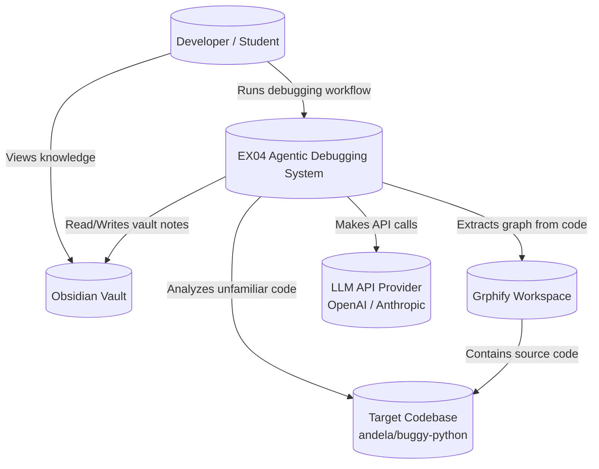
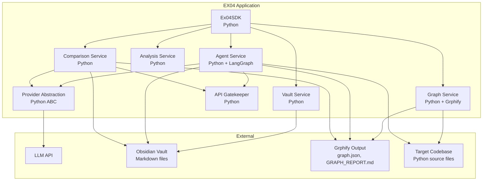
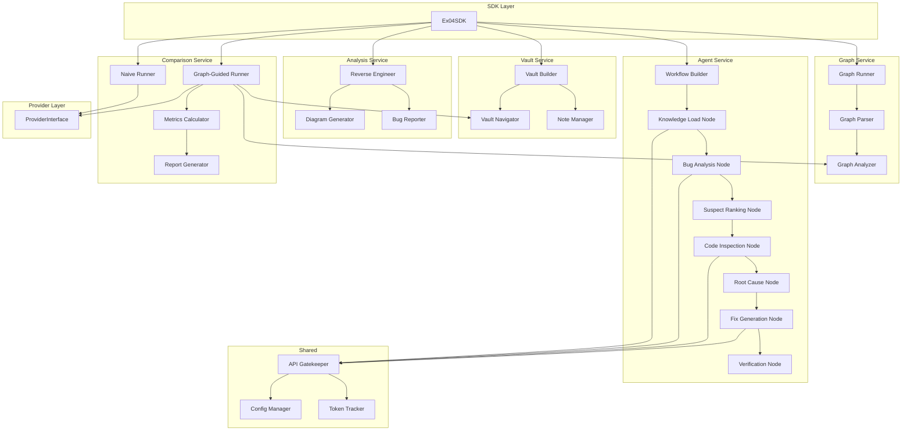

<!-- GENERATED FROM CANONICAL DOCUMENTATION - DO NOT EDIT DIRECTLY -->

# 2. C4 Model

[Back to Home](./Home.md)

### 2.1 C4 Context Diagram

Shows the system in relation to external actors and systems.

**Justification**: [PRD §4.1 In Scope] defines the system as analyzing `andela/buggy-python`, building Grphify graphs, managing Obsidian vaults, and calling LLM APIs. [PRD §1.3 Technology Choices] lists all five external systems.

### 2.2 C4 Container Diagram

Shows the high-level containers and technology stack.

**Justification**: Each container maps to a functional requirement group: [PRD §5.1 FR-1] → Graph Service, [PRD §5.2 FR-2] → Vault Service, [PRD §5.4 FR-4] → Agent Service, [PRD §5.6 FR-6] → Comparison Service.

### 2.3 C4 Component Diagram

Shows the internal components of the EX04 application.

**Justification**: Component decomposition follows [PRD §5.4 FR-4] for the LangGraph workflow with 7 nodes. The naive vs. graph-guided comparison aligns with [PRD §5.6 FR-6.1 to FR-6.3].

---
