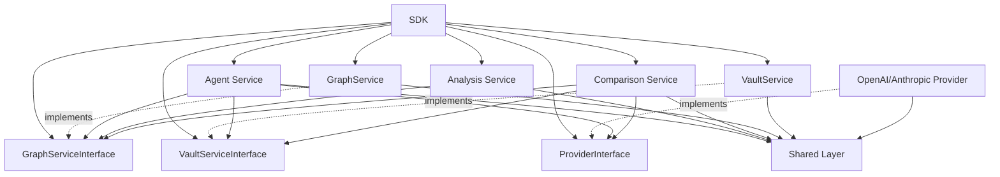

# 3. Module Design

[← Back to Home](./Home.md) | [Prev: C4 Model](./02-C4-Model.md) | [Next: Data Flow →](./04-Data-Flow.md)

---

Each module is an **independent building block** with a well-defined interface. **No module imports another module's concrete implementation** — all inter-module dependencies flow through `*Interface` abstract classes. This enables **fully parallel development**: every team member works against a stable contract while the actual implementation is built in parallel.

**Contract-First Rule**: For every service `XService`, an `XServiceInterface` ABC is defined **before** implementation begins. Other modules depend only on the interface. At runtime, the SDK injects the concrete implementation.

## 3.1 Module Dependency Graph (Runtime)

Solid arrows = **runtime** dependencies (after SDK wiring). Dashed arrows = **compile-time** interface imports only (no blocking).



**Key for parallel development**: `Agent Service`, `Analysis Service`, and `Comparison Service` import only `*Interface` ABCs (zero-cost, no blocking). They never import `GraphService`, `VaultService`, or provider implementations directly.

### 3.1.1 Service Interfaces (Contract Layer)

| Interface | Path | Defines | Enables Parallel Work For |
|---|---|---|---|
| `GraphServiceInterface` | `services/graph/interface.py` | `extract()`, `parse()`, `analyze()` | Agent, Analysis, Comparison |
| `VaultServiceInterface` | `services/vault/interface.py` | `build()`, `navigate()`, `update()` | Agent, Comparison |
| `ProviderInterface` | `providers/interface.py` | `chat()`, `count_tokens()` | Agent, Comparison |
| `AnalysisServiceInterface` | `services/analysis/interface.py` | `reverse_engineer()`, `report()` | SDK |
| `AgentServiceInterface` | `services/agent/interface.py` | `investigate()`, `get_state()` | SDK |
| `ComparisonServiceInterface` | `services/comparison/interface.py` | `run_comparison()` | SDK |

### 3.1.2 Parallel Development Schedule

```mermaid
gantt
    title Parallel Development Timeline
    dateFormat  HH:mm
    axisFormat %H:%M

    section Phase 1-2
    Shared Layer + Interfaces    :p1, 09:00, 2h

    section Phase 3 (Parallel)
    Graph Implementation         :p2a, 11:00, 3h
    Vault Implementation         :p2b, 11:00, 3h
    Provider Implementation      :p2c, 11:00, 2h

    section Phase 4 (Parallel)
    Agent against mocks          :p3a, 14:00, 3h
    Analysis against mocks       :p3b, 14:00, 2h
    Comparison against mocks     :p3c, 14:00, 2h

    section Phase 5
    SDK wires everything         :p4, 17:00, 1h
```



**Point**: After Phase 2 (interfaces are defined), **Phase 3 and 4 run fully in parallel**. No developer waits for another module's implementation.

## 3.2 SDK Module — Single Entry Point

| Attribute | Value |
|---|---|
| **Path** | `src/ex04/sdk/sdk.py` |
| **Responsibility** | Single entry point for all business operations |
| **PRD Mapping** | [PRD §5.4 FR-4] overall orchestration |

**Input**: Operation mode (`graphify`, `investigate`, `compare`, `reverse_engineer`), target codebase path, configuration.

**Output**: Operation results (graph data, investigation findings, comparison report, diagrams).

**Dependencies**: All service modules (delegates only, no direct LLM calls).

```python
class Ex04SDK:
    """
    Single entry point for all EX04 operations.

    All service dependencies are injected through constructor —
    never hard-imported. Enables parallel development via mock injection.

    Input:  config (Config), graph_svc (GraphServiceInterface),
            vault_svc (VaultServiceInterface), agent_svc (AgentServiceInterface),
            analysis_svc (AnalysisServiceInterface),
            comparison_svc (ComparisonServiceInterface)
    Output: OperationResult (dict)
    """

    def __init__(
        self,
        config: Config,
        graph_svc: "GraphServiceInterface",
        vault_svc: "VaultServiceInterface",
        agent_svc: "AgentServiceInterface",
        analysis_svc: "AnalysisServiceInterface",
        comparison_svc: "ComparisonServiceInterface",
    ):
        ...

    def run_graphify(self, target_path: str) -> GraphResult: ...
    def build_vault(self, graph: GraphData) -> VaultResult: ...
    def investigate_bug(self, bug_report: str) -> InvestigationResult: ...
    def run_comparison(self, bug_report: str) -> ComparisonReport: ...
    def reverse_engineer(self, target_path: str) -> EngineeringResult: ...
    def full_pipeline(self, target_path: str, bug_report: str) -> PipelineResult: ...
```

## 3.3 Graph Service — Grphify Integration

| Attribute | Value |
|---|---|
| **Path** | `src/ex04/services/graph/` |
| **Responsibility** | Run Grphify, parse graph output, analyze entity relationships |
| **PRD Mapping** | [PRD §5.1 FR-1.1 to FR-1.5] |

**Sub-modules**:

| File | Responsibility |
|---|---|
| `interface.py` | **Contract** — `GraphServiceInterface` ABC (defined FIRST) |
| `runner.py` | Execute Grphify CLI on target codebase |
| `parser.py` | Parse `graph.json` into structured `GraphData` objects |
| `analyzer.py` | Compute centrality, community detection, God Node identification |

**Input**: Target codebase path (`str`), Grphify configuration (`dict`).

**Output**: `GraphResult` — structured graph with entities, relationships, communities.

**Dependencies**: Shared layer (config, file I/O). Other modules depend only on `interface.py`.

```python
# runner.py
class GraphRunner:
    """Run Grphify on a target codebase."""
    def execute(self, target_path: str) -> Path: ...  # returns graph.json path

# parser.py
class GraphParser:
    """Parse Grphify output into structured data."""
    def parse(self, graph_path: Path) -> GraphData: ...

# analyzer.py
class GraphAnalyzer:
    """Analyze graph for centrality, communities, God Nodes."""
    def find_god_nodes(self, graph: GraphData) -> list[Node]: ...
    def rank_by_centrality(self, graph: GraphData, ref_node: str) -> list[tuple]: ...
    def detect_communities(self, graph: GraphData) -> list[Community]: ...
```

## 3.4 Vault Service — Obsidian Management

| Attribute | Value |
|---|---|
| **Path** | `src/ex04/services/vault/` |
| **Responsibility** | Build, navigate, and update the Obsidian vault |
| **PRD Mapping** | [PRD §5.2 FR-2.1 to FR-2.5] |

**Sub-modules**:

| File | Responsibility |
|---|---|
| `interface.py` | **Contract** — `VaultServiceInterface` ABC (defined FIRST) |
| `builder.py` | Create vault structure with `index.md`, `hot.md`, component notes |
| `navigator.py` | Query vault for relevant context given a bug description |
| `note_manager.py` | Create, update, link individual notes |

**Input**: Graph data, investigation context, bug description.

**Output**: `VaultResult` — paths to generated/updated notes, vault statistics.

**Dependencies**: Shared layer (file I/O, config). Other modules depend only on `interface.py`.

```python
# builder.py
class VaultBuilder:
    """Build Obsidian vault from graph data."""
    def build(self, graph: GraphData) -> VaultResult: ...
    def create_index(self, graph: GraphData) -> Path: ...
    def create_hot(self, focus_area: str) -> Path: ...

# navigator.py
class VaultNavigator:
    """Navigate vault to find relevant context."""
    def find_relevant_notes(self, query: str) -> list[Note]: ...
    def navigate_from_index(self, target: str) -> Note: ...

# note_manager.py
class NoteManager:
    """Manage individual vault notes."""
    def create_note(self, title: str, content: str, links: list[str]) -> Path: ...
    def update_note(self, path: Path, content: str) -> None: ...
```

## 3.5 Agent Service — LangGraph Workflow

| Attribute | Value |
|---|---|
| **Path** | `src/ex04/services/agent/` |
| **Responsibility** | Build and execute the graph-guided debugging workflow |
| **PRD Mapping** | [PRD §5.4 FR-4.1 to FR-4.6] |

**Sub-modules**:

| File | Responsibility |
|---|---|
| `interface.py` | **Contract** — `AgentServiceInterface` ABC (defined FIRST) |
| `workflow.py` | Assemble the LangGraph state machine with all nodes |
| `nodes/knowledge.py` | Knowledge Load node — load graph + vault into context |
| `nodes/analysis.py` | Bug Analysis node — analyze bug reports against graph |
| `nodes/suspect.py` | Suspect Ranking node — rank candidates by centrality |
| `nodes/inspect.py` | Code Inspection node — fetch relevant code snippets |
| `nodes/rootcause.py` | Root Cause node — determine exact bug origin |
| `nodes/fix.py` | Fix Generation node — propose and apply code fix |
| `nodes/verify.py` | Verification node — run tests to confirm fix |
| `state.py` | Define the LangGraph state schema |

**Input**: Bug report (`str`), graph data (`GraphData`), vault path (`Path`).

**Output**: `InvestigationResult` — root cause, fix applied, test results, token usage.

**Dependencies**: Provider layer (LLM calls), Graph Service (graph data), Vault Service (vault context), Shared (gatekeeper).

```python
# state.py
class AgentState(TypedDict):
    bug_report: str
    graph_context: str
    vault_context: str
    suspects: list[Suspect]
    inspected_code: str
    root_cause: str
    proposed_fix: str
    fix_applied: bool
    test_results: dict
    token_usage: TokenMetrics

# workflow.py
class WorkflowBuilder:
    """Build LangGraph debugging workflow."""
    def build(self) -> StateGraph: ...
    def add_nodes(self, graph: StateGraph) -> StateGraph: ...
    def add_edges(self, graph: StateGraph) -> StateGraph: ...

# nodes/knowledge.py
class KnowledgeLoadNode:
    """Load graph + vault context into agent state."""
    def __call__(self, state: AgentState) -> AgentState: ...
```

## 3.6 Analysis Service — Reverse Engineering & Bug Reporting

| Attribute | Value |
|---|---|
| **Path** | `src/ex04/services/analysis/` |
| **Responsibility** | Reverse engineer architecture, generate diagrams, produce bug reports |
| **PRD Mapping** | [PRD §5.3 FR-3.1 to FR-3.3], [PRD §5.5 FR-5.1 to FR-5.4] |

**Sub-modules**:

| File | Responsibility |
|---|---|
| `interface.py` | **Contract** — `AnalysisServiceInterface` ABC (defined FIRST) |
| `reverse_engineer.py` | Extract architectural and OOP schemas from code/graph |
| `diagram_gen.py` | Generate Mermaid diagrams (block diagram, OOP schema) |
| `bug_report.py` | Generate structured bug analysis reports |

**Input**: Graph data, code snippets, investigation results.

**Output**: `EngineeringResult` — diagrams, reports, architectural insights.

**Dependencies**: Graph Service (graph data), Shared (file I/O).

```python
class ReverseEngineer:
    """Extract architectural understanding from code/graph."""
    def extract_block_schema(self, graph: GraphData) -> str: ...  # Mermaid
    def extract_oop_schema(self, graph: GraphData) -> str: ...  # Mermaid
    def identify_patterns(self, graph: GraphData) -> list[Pattern]: ...

class DiagramGenerator:
    """Generate and save diagrams."""
    def save_diagram(self, content: str, name: str, path: Path) -> Path: ...

class BugReporter:
    """Generate structured bug analysis report."""
    def generate(self, investigation: InvestigationResult) -> str: ...
```

## 3.7 Comparison Service — Token Savings Proof

| Attribute | Value |
|---|---|
| **Path** | `src/ex04/services/comparison/` |
| **Responsibility** | Run naive baseline and graph-guided approaches, compare metrics |
| **PRD Mapping** | [PRD §5.6 FR-6.1 to FR-6.3] |

**Sub-modules**:

| File | Responsibility |
|---|---|
| `interface.py` | **Contract** — `ComparisonServiceInterface` ABC (defined FIRST) |
| `naive_runner.py` | Execute naive approach (read all raw files, no focus) |
| `graph_guided_runner.py` | Execute graph-guided approach (via vault + graph) |
| `metrics.py` | Calculate token savings, file reads, iteration counts |
| `report_gen.py` | Generate comparison report with tables and charts |

**Input**: Bug report, target codebase path, graph data, vault path.

**Output**: `ComparisonReport` — side-by-side metrics, savings percentage, narrative.

**Dependencies**: Provider layer (LLM calls for both approaches), Graph Service (graph for guided mode), Vault Service (vault for guided mode), Shared (gatekeeper, token tracker).

```python
class NaiveRunner:
    """Run naive baseline: dump all code, no graph guidance."""
    def run(self, bug_report: str, source_files: list[Path]) -> RunMetrics: ...

class GraphGuidedRunner:
    """Run graph-guided: navigate via graph + vault first."""
    def run(self, bug_report: str, graph: GraphData, vault: VaultNavigator) -> RunMetrics: ...

class MetricsCalculator:
    """Compare two runs and calculate savings."""
    def compare(self, naive: RunMetrics, guided: RunMetrics) -> ComparisonMetrics: ...

class ReportGenerator:
    """Generate comparison report."""
    def generate(self, metrics: ComparisonMetrics) -> str: ...
```

## 3.8 Provider Layer — Provider-Agnostic LLM Abstraction

| Attribute | Value |
|---|---|
| **Path** | `src/ex04/providers/` |
| **Responsibility** | Abstract LLM provider behind unified interface |
| **PRD Mapping** | Supports [PRD §1.3 Technology Choices] — no vendor lock-in |

**Sub-modules**:

| File | Responsibility |
|---|---|
| `interface.py` | `ProviderInterface` abstract base class |
| `openai_provider.py` | OpenAI implementation |
| `anthropic_provider.py` | Anthropic implementation |
| `factory.py` | Create provider from configuration |

**Input**: Prompt text, system instructions, model name.

**Output**: `ProviderResponse` — generated text, token counts (input/output), model used.

**Dependencies**: Shared layer (config).

```python
# interface.py
class ProviderInterface(ABC):
    """Abstract interface for LLM providers.

    All LLM calls must flow through this interface to ensure
    provider-agnostic design. The Gatekeeper controls rate limits.
    Supports custom base_url for proxy/local endpoints.
    """

    @abstractmethod
    def chat(
        self,
        messages: list[Message],
        model: str,
        base_url: str | None = None,
    ) -> ProviderResponse: ...

    @abstractmethod
    def count_tokens(self, text: str) -> int: ...

# factory.py
class ProviderFactory:
    """Create provider instance from configuration."""
    @staticmethod
    def create(provider_name: str, config: dict) -> ProviderInterface: ...
    # config must include: name, model, api_key_env, base_url (optional)
```

## 3.9 Shared Layer — Infrastructure

| Attribute | Value |
|---|---|
| **Path** | `src/ex04/shared/` |
| **Responsibility** | Cross-cutting concerns: gatekeeper, config, version, tokens |
| **PRD Mapping** | [PRD §6 Non-Functional Requirements NFR-1 to NFR-9] |

**Sub-modules**:

| File | Responsibility |
|---|---|
| `gatekeeper.py` | Rate limiting, FIFO queue, API call monitoring |
| `config.py` | Load and validate configuration from JSON/env |
| `version.py` | Global version tracking (1.00) |
| `token_tracker.py` | Track token consumption across all providers |
| `types.py` | Shared data classes and TypedDicts |

```python
# types.py
class TokenMetrics:
    input_tokens: int
    output_tokens: int
    total_tokens: int
    provider: str
    model: str

class GraphData:
    entities: list[Entity]
    relationships: list[Relationship]
    communities: list[Community]

class RunMetrics:
    tokens_used: int
    files_read: int
    iterations: int
    time_seconds: float
    found_root_cause: bool

class ComparisonMetrics:
    naive: RunMetrics
    guided: RunMetrics
    token_savings_pct: float
    file_read_savings_pct: float
    iteration_savings_pct: float

class PipelineResult:
    graph_result: GraphResult
    vault_result: VaultResult
    investigation: InvestigationResult
    comparison: ComparisonReport
    engineering: EngineeringResult
```

---

**Navigation**: [← Back to Home](./Home.md) | [Prev: C4 Model](./02-C4-Model.md) | [Next: Data Flow →](./04-Data-Flow.md)
