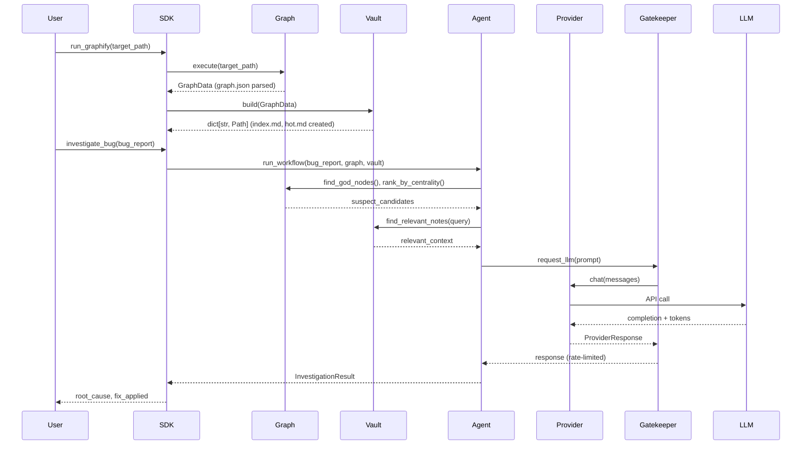
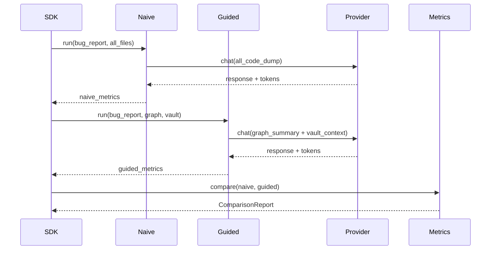

<!-- GENERATED FROM CANONICAL DOCUMENTATION - DO NOT EDIT DIRECTLY -->

# 4. Data Flow

[Back to Home](./Home.md)

### 4.1 End-to-End Workflow

```mermaid
sequenceDiagram
    participant User
    participant SDK
    participant Graph
    participant Vault
    participant Agent
    participant Provider
    participant Gatekeeper
    participant LLM

    User->>SDK: run_graphify(target_path)
    SDK->>Graph: execute(target_path)
    Graph-->>SDK: GraphData (graph.json parsed)

    SDK->>Vault: build(GraphData)
    Vault-->>SDK: dict[str, Path] (index.md, hot.md created)

    User->>SDK: investigate_bug(bug_report)
    SDK->>Agent: run_workflow(bug_report, graph, vault)

    Agent->>Graph: find_god_nodes(), rank_by_centrality()
    Graph-->>Agent: suspect_candidates

    Agent->>Vault: find_relevant_notes(query)
    Vault-->>Agent: relevant_context

    Agent->>Gatekeeper: request_llm(prompt)
    Gatekeeper->>Provider: chat(messages)
    Provider->>LLM: API call
    LLM-->>Provider: completion + tokens
    Provider-->>Gatekeeper: ProviderResponse
    Gatekeeper-->>Agent: response (rate-limited)

    Agent-->>SDK: InvestigationResult
    SDK-->>User: root_cause, fix_applied
```

### 4.2 Comparison Workflow

```mermaid
sequenceDiagram
    participant SDK
    participant Naive
    participant Guided
    participant Provider
    participant Metrics

    SDK->>Naive: run(bug_report, all_files)
    Naive->>Provider: chat(all_code_dump)
    Provider-->>Naive: response + tokens
    Naive-->>SDK: naive_metrics

    SDK->>Guided: run(bug_report, graph, vault)
    Guided->>Provider: chat(graph_summary + vault_context)
    Provider-->>Guided: response + tokens
    Guided-->>SDK: guided_metrics

    SDK->>Metrics: compare(naive, guided)
    Metrics-->>SDK: ComparisonReport
```

---
