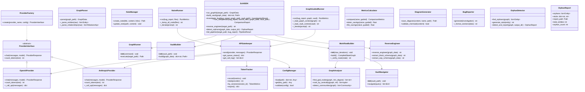

<!-- GENERATED FROM CANONICAL DOCUMENTATION - DO NOT EDIT DIRECTLY -->

# 6. OOP Schema

[Back to Home](./Home.md)

```mermaid
classDiagram
    class ProviderInterface {
        <<abstract>>
        +chat(messages, model) ProviderResponse
        +count_tokens(text) int
    }

    class OpenAIProvider {
        +chat(messages, model) ProviderResponse
        +count_tokens(text) int
        +_call_api(messages) dict
    }

    class AnthropicProvider {
        +chat(messages, model) ProviderResponse
        +count_tokens(text) int
        +_call_api(messages) dict
    }

    class ProviderFactory {
        +create(provider_name, config) ProviderInterface
    }

    class GraphRunner {
        +__init__(command) void
        +execute(target_path) Path
    }

    class GraphParser {
        +parse(graph_path) GraphData
        +_parse_entities(raw) list~Entity~
        +_parse_relationships(raw) list~Relationship~
    }

    class GraphAnalyzer {
        +find_god_nodes(graph, min_degree) list~str~
        +rank_by_centrality(graph, ref) list~tuple~
        +detect_communities(graph) list~Community~
    }

    class VaultBuilder {
        +__init__(vault_path) void
        +build(graph_data) dict~str, Path~
    }

    class VaultNavigator {
        +__init__(vault_path) void
        +navigate(query) list~dict~
    }

    class NoteManager {
        +create_note(title, content, links) Path
        +update_note(path, content) void
    }

    class WorkflowBuilder {
        +__init__(max_iterations) void
        +build() CompiledStateGraph
        +_verify_route(state) str
    }

    class Ex04SDK {
        +run_graphify(target_path) GraphData
        +build_vault(graph_data) dict~str, Path~
        +investigate_bug(bug_report, graph_path, vault_path) InvestigationResult
        +run_comparison(bug_report, source_files, graph_data, vault_path) ComparisonReport
        +reverse_engineer(target_path) str
        +detect_orphans(graph_data, output_dir) OrphanReport
        +full_pipeline(target_path, bug_report) PipelineResult
    }

    class APIGatekeeper {
        +send(provider, messages) ProviderResponse
        +get_queue_status() dict
        +get_call_log() list~dict~
    }

    class ConfigManager {
        +load(path) dict~str, Any~
        +get(key_path) Any
        +validate(config) bool
    }

    class TokenTracker {
        +record(metrics) void
        +total(provider) int
        +by_session(session_id) TokenMetrics
        +export() dict
    }

    class NaiveRunner {
        +run(bug_report, files) RunMetrics
        +_dump_all_code(files) str
        +_iterate(prompt) str
    }

    class GraphGuidedRunner {
        +run(bug_report, graph, vault) RunMetrics
        +_load_graph_context(graph) str
        +_load_vault_context(vault) str
        +_iterate(prompt) str
    }

    class MetricsCalculator {
        +compare(naive, guided) ComparisonMetrics
        +token_savings(naive, guided) float
        +file_savings(naive, guided) float
    }

    class ReverseEngineer {
        +reverse_engineer(graph_data) str
        +extract_block_schema(graph_data) str
        +extract_oop_schema(graph_data) str
    }

    class DiagramGenerator {
        +save_diagram(content, name, path) Path
        +validate_mermaid(content) bool
    }

    class BugReporter {
        +generate(investigation) str
        +_format_sections(data) str
    }

    class OrphanDetector {
        +find_orphans(graph) list~Entity~
        +generate_stub(entity) str
        +detect_and_report(graph, output_dir) OrphanReport
    }

    class OrphanReport {
        +orphans: list~Entity~
        +stubs: dict~str, str~
        +report_path: Path
        +total_entities: int
        +orphan_count: int
    }

    ProviderInterface <|-- OpenAIProvider
    ProviderInterface <|-- AnthropicProvider
    ProviderFactory ..> ProviderInterface
    Ex04SDK --> GraphRunner
    Ex04SDK --> VaultBuilder
    Ex04SDK --> WorkflowBuilder
    Ex04SDK --> ReverseEngineer
    WorkflowBuilder --> GraphAnalyzer
    WorkflowBuilder --> VaultNavigator
    APIGatekeeper --> OpenAIProvider
    APIGatekeeper --> AnthropicProvider
    APIGatekeeper --> TokenTracker
    APIGatekeeper --> ConfigManager
    NaiveRunner --> APIGatekeeper
    GraphGuidedRunner --> APIGatekeeper
```

---
