```mermaid
classDiagram
    class ProviderInterface {
        <<abstract>>
        +chat(messages, model) ProviderResponse
        +count_tokens(text) int
    }

    class OpenAIProvider {
        +chat(messages, model) ProviderResponse
        +count_tokens(text) int
        +_call_api(messages) dict
    }

    class AnthropicProvider {
        +chat(messages, model) ProviderResponse
        +count_tokens(text) int
        +_call_api(messages) dict
    }

    class ProviderFactory {
        +create(provider_name, config) ProviderInterface
    }

    class GraphRunner {
        +execute(target_path) Path
        +_run_cli(args) subprocess.CompletedProcess
    }

    class GraphParser {
        +parse(graph_path) GraphData
        +_parse_entities(raw) list~Entity~
        +_parse_relationships(raw) list~Relationship~
    }

    class GraphAnalyzer {
        +find_god_nodes(graph) list~Node~
        +rank_by_centrality(graph, ref) list~tuple~
        +detect_communities(graph) list~Community~
    }

    class VaultBuilder {
        +build(graph) VaultResult
        +create_index(graph) Path
        +create_hot(focus_area) Path
    }

    class VaultNavigator {
        +find_relevant_notes(query) list~Note~
        +navigate_from_index(target) Note
    }

    class NoteManager {
        +create_note(title, content, links) Path
        +update_note(path, content) void
    }

    class WorkflowBuilder {
        +build() StateGraph
        +add_nodes(graph) StateGraph
        +add_edges(graph) StateGraph
    }

    class Ex04SDK {
        +run_graphify(target_path) GraphResult
        +build_vault(graph) VaultResult
        +investigate_bug(bug_report) InvestigationResult
        +run_comparison(bug_report) ComparisonReport
        +reverse_engineer(target_path) EngineeringResult
    }

    class APIGatekeeper {
        +send(provider, messages) ProviderResponse
        +enqueue(provider, messages) QueueItem
        +get_queue_status() dict
        +get_call_log() list~Entry~
    }

    class ConfigManager {
        +load(config_path) Config
        +get(key) any
        +validate(config) bool
    }

    class TokenTracker {
        +record(metrics) void
        +total(provider) int
        +by_session(session_id) TokenMetrics
        +export() dict
    }

    class NaiveRunner {
        +run(bug_report, files) RunMetrics
        +_dump_all_code(files) str
        +_iterate(prompt) str
    }

    class GraphGuidedRunner {
        +run(bug_report, graph, vault) RunMetrics
        +_load_graph_context(graph) str
        +_load_vault_context(vault) str
        +_iterate(prompt) str
    }

    class MetricsCalculator {
        +compare(naive, guided) ComparisonMetrics
        +token_savings(naive, guided) float
        +file_savings(naive, guided) float
    }

    class ReverseEngineer {
        +extract_block_schema(graph) str
        +extract_oop_schema(graph) str
        +identify_patterns(graph) list~Pattern~
    }

    class DiagramGenerator {
        +save_diagram(content, name, path) Path
        +validate_mermaid(content) bool
    }

    class BugReporter {
        +generate(investigation) str
        +_format_sections(data) str
    }

    ProviderInterface <|-- OpenAIProvider
    ProviderInterface <|-- AnthropicProvider
    ProviderFactory ..> ProviderInterface
    Ex04SDK --> GraphRunner
    Ex04SDK --> VaultBuilder
    Ex04SDK --> WorkflowBuilder
    Ex04SDK --> ReverseEngineer
    Ex04SDK --> NaiveRunner
    Ex04SDK --> GraphGuidedRunner
    WorkflowBuilder --> GraphAnalyzer
    WorkflowBuilder --> VaultNavigator
    GraphGuidedRunner --> GraphAnalyzer
    GraphGuidedRunner --> VaultNavigator
    OpenAIProvider --> APIGatekeeper
    AnthropicProvider --> APIGatekeeper
    APIGatekeeper --> TokenTracker
    APIGatekeeper --> ConfigManager
    NaiveRunner --> APIGatekeeper
    GraphGuidedRunner --> APIGatekeeper
```

# 6. OOP Schema

[← Back to Home](./Home.md) | [Prev: ADRs](./05-ADRs.md) | [Next: UML Activity Diagram →](./07-UML-Activity-Diagram.md)

---

---

**Navigation**: [← Back to Home](./Home.md) | [Prev: ADRs](./05-ADRs.md) | [Next: UML Activity Diagram →](./07-UML-Activity-Diagram.md)
