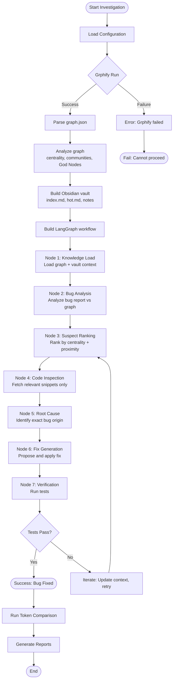

<!-- GENERATED FROM CANONICAL DOCUMENTATION - DO NOT EDIT DIRECTLY -->

# 7. UML Activity Diagram — Main Investigation Flow

[Back to Home](./Home.md)

```mermaid
flowchart TD
    START([Start Investigation]) --> LOAD[Load Configuration]
    LOAD --> GRAPHIFY{Grphify Run}
    GRAPHIFY -->|Success| PARSE[Parse graph.json]
    GRAPHIFY -->|Failure| ERR_GRAPH[Error: Grphify failed]
    PARSE --> ANALYZE[Analyze graph<br/>centrality, communities, God Nodes]
    ANALYZE --> BUILD_VAULT[Build Obsidian vault<br/>index.md, hot.md, notes]
    BUILD_VAULT --> BUILD_WORKFLOW[Build LangGraph workflow]

    BUILD_WORKFLOW --> NODE1[Node 1: Knowledge Load<br/>Load graph + vault context]
    NODE1 --> NODE2[Node 2: Bug Analysis<br/>Analyze bug report vs graph]
    NODE2 --> NODE3[Node 3: Suspect Ranking<br/>Rank by centrality + proximity]
    NODE3 --> NODE4[Node 4: Code Inspection<br/>Fetch relevant snippets only]
    NODE4 --> NODE5[Node 5: Root Cause<br/>Identify exact bug origin]
    NODE5 --> NODE6[Node 6: Fix Generation<br/>Propose and apply fix]
    NODE6 --> NODE7[Node 7: Verification<br/>Run tests]

    NODE7 --> VERIFIED{Tests Pass?}
    VERIFIED -->|Yes| SUCCESS([Success: Bug Fixed])
    VERIFIED -->|No| ITERATE[Iterate: Update context, retry]
    ITERATE --> NODE3

    ERR_GRAPH --> FAIL([Fail: Cannot proceed])

    SUCCESS --> COMPARE[Run Token Comparison]
    COMPARE --> REPORT[Generate Reports]
    REPORT --> END([End])
```

---
