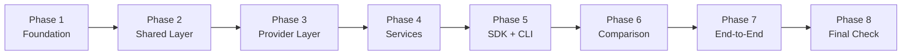

<!-- GENERATED FROM CANONICAL DOCUMENTATION - DO NOT EDIT DIRECTLY -->

# 1. Phase Overview

[Back to Home](./Home.md)

Each phase consists of **independent, verifiable tasks**. Tasks are independently verifiable and parallel by default, except where explicit task-level dependencies are documented. Tasks within a phase may run in parallel unless a task-level dependency is listed in the task definition or in [PLAN §3 Task Dependency Policy].

| Phase | Deliverable | Independent Verification |
|---|---|---|
| **Phase 1** | Project structure, config, `.env` | `uv run ruff check` passes, structure matches [PLAN §10] |
| **Phase 2** | Shared layer fully tested | Unit tests for gatekeeper, config, version, types pass in isolation |
| **Phase 3** | Provider abstraction working | Mock-based tests verify `ProviderInterface` contract without real API |
| **Phase 4** | All services implemented | Each service testable with mocked dependencies |
| **Phase 5** | SDK orchestrates services | Integration test: SDK calls all services through mocks |
| **Phase 6** | Comparison produces metrics | Naive and guided runners produce comparable `RunMetrics` |
| **Phase 7** | Full pipeline executes | End-to-end test with real target codebase produces reports |
| **Phase 8** | Submission ready | [PRD §12 Final Checklist] passes |

---
