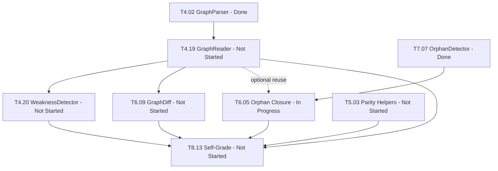

<!-- GENERATED FROM CANONICAL DOCUMENTATION - DO NOT EDIT DIRECTLY -->

# 10. Task Dependency Summary

[Back to Home](./Home.md)

```mermaid
graph TD
    subgraph P1["Phase 1: Foundation"]
        T101[T1.01 Structure]
        T102[T1.02 Config]
        T103[T1.03 pyproject]
        T104[T1.04 Types]
    end

    subgraph P2["Phase 2: Shared"]
        T201[T2.01 Version]
        T202[T2.02 Types]
        T203[T2.03 Config]
        T204[T2.04 Gatekeeper]
        T205[T2.05 Tokens]
        T206[T2.06 __init__]
    end

    subgraph P3["Phase 3: Providers"]
        T301[T3.01 Interface]
        T302[T3.02 OpenAI]
        T303[T3.03 Anthropic]
        T304[T3.04 Factory]
        T305[T3.05 __init__]
    end

    subgraph P4["Phase 4: Services"]
        T400[T4.00 Config Impl]
        T4002[T4.002 Gatekeeper Impl]
        T401[T4.01 Graph Runner]
        T402[T4.02 Graph Parser]
        T403[T4.03 Graph Analyzer]
        T404[T4.04 Vault Builder]
        T405[T4.05 Vault Nav]
        T406[T4.06 Vault Notes]
        T407[T4.07 Agent State]
        T408[T4.08 Workflow]
        T409[T4.09 Knowledge]
        T410[T4.10 Analysis]
        T411[T4.11 Suspect]
        T412[T4.12 Inspect]
        T413[T4.13 Root Cause]
        T414[T4.14 Fix]
        T415[T4.15 Verify]
        T416[T4.16 Reverse Eng]
        T417[T4.17 Diagrams]
        T418[T4.18 Bug Report]
    end

    T400 --> T4002
    T400 --> T401
    T400 --> T404
    T4002 --> T407

    subgraph P5["Phase 5: SDK+CLI"]
        T501[T5.01 SDK]
        T502[T5.02 CLI]
    end

    subgraph P6["Phase 6: Comparison"]
        T601[T6.01 Naive]
        T602[T6.02 Guided]
        T603[T6.03 Metrics]
        T604[T6.04 Report]
        T605[T6.05 Extension]
    end

    subgraph P7["Phase 7: E2E"]
        T701[T7.01 Grphify]
        T702[T7.02 Vault]
        T703[T7.03 Investigate]
        T704[T7.04 Compare]
        T705[T7.05 Reverse Eng]
        T706[T7.06 Update Vault]
    end

    subgraph P8["Phase 8: Final"]
        T801[T8.01 Tests]
        T802[T8.02 Ruff]
        T803[T8.03 Line Limit]
        T804[T8.04 README]
        T805[T8.05 Checklist]
    end

    P1 --> P2 --> P3 --> P4 --> P5 --> P6 --> P7 --> P8

    classDef phase1 fill:#e1f5fe,stroke:#01579b
    classDef phase2 fill:#e8f5e9,stroke:#1b5e20
    classDef phase3 fill:#fff3e0,stroke:#e65100
    classDef phase4 fill:#f3e5f5,stroke:#4a148c
    classDef phase5 fill:#e0f7fa,stroke:#006064
    classDef phase6 fill:#fce4ec,stroke:#880e4f
    classDef phase7 fill:#fff9c4,stroke:#f57f17
    classDef phase8 fill:#e0e0e0,stroke:#212121
```

### Remaining Task Dependency Order

The six remaining open tasks have explicit dependencies overriding the default parallel policy:

**Execution order**: T4.19 → T5.03 → T4.20 → T6.05 → T6.09 → T8.13

---
