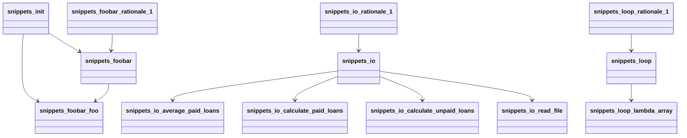

# Architecture Analysis

## Overview
- **Entities**: 13
- **Relationships**: 11
- **Communities**: 3

## Block Diagram

```mermaid
block
  id"_graphify_repos_andela_buggy-python_snippets___init___py" [.graphify/repos/andela/buggy-python/snippets/__init__.py]
  id"snippets_init" [snippets_init]
  id"_graphify_repos_andela_buggy-python_snippets_foobar_py" [.graphify/repos/andela/buggy-python/snippets/foobar.py]
  id"snippets_foobar" [snippets_foobar]
  id"snippets_foobar_foo" [snippets_foobar_foo]
  id"snippets_foobar_rationale_1" [snippets_foobar_rationale_1]
  id"_graphify_repos_andela_buggy-python_snippets_io_py" [.graphify/repos/andela/buggy-python/snippets/io.py]
  id"snippets_io" [snippets_io]
  id"snippets_io_read_file" [snippets_io_read_file]
  id"snippets_io_calculate_unpaid_loans" [snippets_io_calculate_unpaid_loans]
  id"snippets_io_calculate_paid_loans" [snippets_io_calculate_paid_loans]
  id"snippets_io_average_paid_loans" [snippets_io_average_paid_loans]
  id"snippets_io_rationale_1" [snippets_io_rationale_1]
  id"_graphify_repos_andela_buggy-python_snippets_loop_py" [.graphify/repos/andela/buggy-python/snippets/loop.py]
  id"snippets_loop" [snippets_loop]
  id"snippets_loop_lambda_array" [snippets_loop_lambda_array]
  id"snippets_loop_rationale_1" [snippets_loop_rationale_1]
  snippets_init --> snippets_foobar
  snippets_init --> snippets_foobar_foo
  snippets_foobar --> snippets_foobar_foo
  snippets_foobar_rationale_1 --> snippets_foobar
  snippets_io --> snippets_io_average_paid_loans
  snippets_io --> snippets_io_calculate_paid_loans
  snippets_io --> snippets_io_calculate_unpaid_loans
  snippets_io --> snippets_io_read_file
  snippets_io_rationale_1 --> snippets_io
  snippets_loop --> snippets_loop_lambda_array
  snippets_loop_rationale_1 --> snippets_loop
```

## OOP Schema



## Entity Summary
- **code**: 10
- **rationale**: 3

## Relationships
- **contains**: 6
- **imports**: 1
- **rationale_for**: 3
- **re_exports**: 1

## Communities
- **Community 1**: 4 entities
- **Community 0**: 6 entities
- **Community 2**: 3 entities

## Patterns
- No distinct patterns detected
